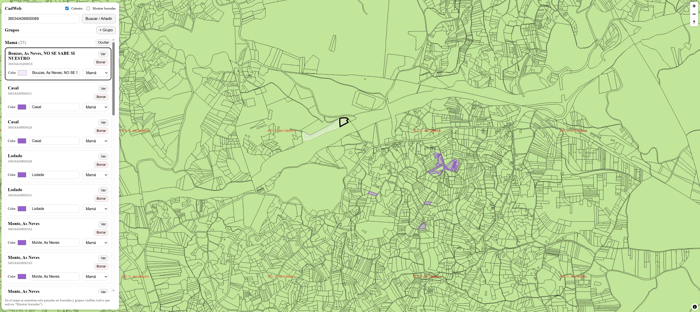

# CadWeb – Visor personal del Catastro

CadWeb es una **aplicación web personal** para consultar, guardar y gestionar parcelas catastrales en España.  
Permite buscar parcelas por **referencia catastral**, visualizarlas en un mapa, organizarlas por grupos, asignar colores y nombres, y mantener un historial persistente sin repetir llamadas innecesarias a los servicios oficiales del Catastro.

La aplicación está pensada para **uso privado**, sin sistema de login, con foco en estabilidad, caché y control de peticiones externas.

CadWeb is a **personal web application** to query, store, and manage cadastral parcels in Spain.  
It allows searching parcels by **cadastral reference**, visualizing them on a map, organizing them into groups, assigning colors and names, and maintaining a persistent history without making unnecessary repeated calls to official Cadastre services.

The application is designed for **private use**, with no login system, and focuses on stability, caching, and controlled access to external services.

---

## Puesta en marcha

Ejecuta:

```bash
docker compose up -d --build
```

---

## Visión



---

## Características principales

- **Búsqueda por referencia catastral**
    - Consulta oficial mediante WFS del Catastro (GML → GeoJSON).
    - Conversión y reproyección automática a EPSG:4326.

- **Mapa interactivo**
    - MapLibre GL como motor de mapas.
    - Visualización vectorial de parcelas guardadas.
    - Capa raster opcional del Catastro (WMS) como fondo visual.

- **Caché persistente**
    - Las parcelas consultadas se guardan en PostGIS.
    - Evita repetir peticiones al Catastro.
    - Soporte de *soft delete* (no se pierde la geometría).

- **Gestión avanzada**
    - Asignar nombre y color a cada parcela.
    - Agrupar parcelas y ocultar/mostrar grupos completos.
    - Resaltado y zoom automático a la parcela seleccionada.

- **Protección frente a rate-limit**
    - Circuit breaker automático cuando el Catastro bloquea por exceso de peticiones.
    - El sistema se auto-protege y evita llamadas inútiles.

---

## Arquitectura

La aplicación está dockerizada y separada por capas:

```text
cadweb/
├── api/        # FastAPI + SQLAlchemy + PostGIS
├── web/        # Next.js + MapLibre GL
└── docker-compose.yml
```

### Backend

El backend está desarrollado con **FastAPI** y actúa como capa intermedia entre el frontend y los servicios oficiales del Catastro, gestionando la lógica de negocio, la persistencia de datos y la protección frente a límites de uso externos.

**Tecnologías**
- FastAPI
- PostgreSQL + PostGIS
- SQLAlchemy + GeoAlchemy2
- Uvicorn

**Responsabilidades principales**
- Exponer una API REST para la gestión de parcelas y grupos.
- Consultar el Catastro mediante WFS (GML/XML) para obtener geometría oficial.
- Convertir GML a GeoJSON y reproyectar a EPSG:4326.
- Almacenar parcelas en PostGIS como caché persistente.
- Implementar *soft delete* para evitar pérdidas de datos y llamadas repetidas.
- Actuar como proxy WMS para evitar problemas de CORS en el navegador.
- Proteger el sistema frente a *rate-limit* del Catastro mediante un circuit breaker.

**Endpoints principales**
- `POST /parcels/lookup`  
  Busca una parcela por referencia catastral.  
  Consulta primero la base de datos y, si no existe, accede al WFS del Catastro.

- `GET /parcels`  
  Devuelve todas las parcelas almacenadas (opcionalmente incluyendo las borradas).

- `PATCH /parcels/{cadastral_ref}`  
  Actualiza metadatos de una parcela (nombre, color, grupo, estado).

- `DELETE /parcels/{cadastral_ref}`  
  Realiza un borrado lógico (*soft delete*).

- `GET /groups` / `POST /groups`  
  Gestión de grupos de parcelas.

- `GET /wms/catastro`  
  Proxy del WMS oficial del Catastro con caché y sin restricciones CORS.

**Notas**
- El backend es la única capa que se comunica directamente con el Catastro.
- Todas las llamadas externas están controladas y cacheadas.
- El diseño prioriza estabilidad y uso responsable de servicios oficiales.
