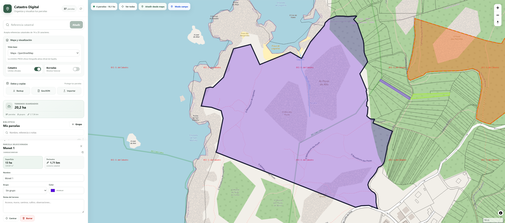
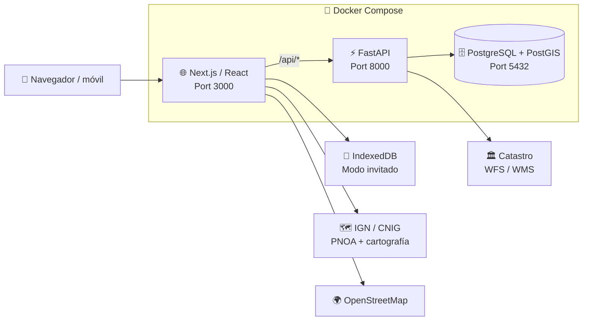

<div align="center">

# 🗺️ Catastro Digital

### Visor, organizador y herramienta de campo para parcelas catastrales en España



<br>


**Catastro Digital** permite localizar, visualizar, organizar y conservar parcelas catastrales en un mapa interactivo, combinando geometría oficial del Catastro, ortofotografía, cartografía, cuentas de usuario, uso como invitado y herramientas de campo.

[Características](#-qué-puede-hacer) ·
[Modo invitado](#-modo-invitado) ·
[Cuentas](#-cuentas-y-sincronización) ·
[Instalación](#-instalación) ·
[Modo campo](#-modo-campo) ·
[Backups](#-backup-exportación-e-importación) ·
[Tecnologías](#-stack-tecnológico)

</div>

---

## 🌍 ¿Qué es Catastro Digital?

Catastro Digital nace con una idea sencilla:

> **Poder entender, organizar y consultar visualmente tus terrenos sin depender de una lista de referencias catastrales difícil de interpretar.**

La aplicación consulta y representa geometrías catastrales españolas sobre un mapa interactivo y permite añadir una capa personal de organización: nombres, colores, grupos, notas, estados y métricas.

Cada parcela puede tener su propio:

- 🏷️ nombre;
- 🎨 color;
- 📁 grupo;
- 📝 notas;
- 📐 superficie;
- 🌱 superficie en hectáreas;
- 📏 perímetro;
- 🗑️ estado activo o eliminado.

Además, varias parcelas pueden agruparse para comprenderlas como una única finca o conjunto territorial.

Ejemplo:

```text
Finca familiar
├── Casa                  0,83 ha
├── Prado                 0,47 ha
├── Monte                 1,31 ha
└── Huerta                0,16 ha

Total                     2,77 ha
```

---

# ✨ ¿Qué puede hacer?

## 🧭 Visualizar parcelas

Las parcelas guardadas se representan directamente sobre el mapa mediante su geometría real.

Puedes:

- asignar un color diferente a cada parcela;
- seleccionar una parcela desde la lista o desde el mapa;
- centrar automáticamente la cámara sobre ella;
- ocultar grupos completos;
- mostrar u ocultar parcelas eliminadas;
- consultar sus datos sin abandonar el mapa;
- trabajar con mapa, ortofoto y cartografía topográfica.

---

## 🖱️ Identificar parcelas haciendo clic o tocando el mapa

No necesitas conocer previamente la referencia catastral.

En la experiencia actual, un clic o toque normal sobre el mapa intenta identificar la parcela bajo ese punto:

1. obtiene las coordenadas;
2. consulta la información catastral disponible;
3. identifica el polígono correspondiente;
4. muestra una previsualización;
5. permite guardar la parcela explícitamente.

Si pulsas una parcela que ya está guardada, se abre directamente sin lanzar una nueva identificación.

También sigue disponible la búsqueda tradicional por **referencia catastral**.

---

## 🛰️ Diferentes vistas del terreno

Puedes cambiar el mapa base en cualquier momento.

| Vista | Uso recomendado |
|---|---|
| 🗺️ **Mapa** | Carreteras, pueblos, caminos y contexto general |
| 🛰️ **Ortofoto PNOA** | Vegetación, construcciones, caminos, muros y terreno real |
| ⛰️ **Topográfico IGN** | Relieve y lectura cartográfica tradicional |

La capa de límites del Catastro es independiente del mapa base.

Una combinación especialmente útil es:

**Ortofoto PNOA + límites catastrales + parcelas coloreadas**

---

## 📐 Superficie, hectáreas y perímetros

Las métricas de las parcelas autenticadas se calculan a partir de las geometrías almacenadas en **PostGIS**.

Cada parcela puede mostrar:

- superficie en `m²`;
- superficie en `ha`;
- perímetro en metros.

Ejemplo:

```text
Finca de Bouzas

Superficie       8.342 m²
Hectáreas        0,8342 ha
Perímetro        412 m
```

Los grupos también muestran estadísticas agregadas.

---

## 📁 Organización por grupos

Las parcelas pueden organizarse en grupos como:

- Familia
- Propias
- En estudio
- Monte
- Casa
- Herencia
- Ponteareas
- As Neves

Cada grupo puede mostrar:

- número de parcelas;
- superficie total;
- hectáreas totales.

Los grupos pueden:

- crearse;
- renombrarse;
- ocultarse;
- eliminarse.

Si se elimina un grupo, sus parcelas permanecen almacenadas y pasan a **Sin grupo**.

---

## 🔎 Búsqueda y filtrado

Puedes localizar rápidamente parcelas por:

- nombre;
- referencia catastral;
- notas;
- grupo.

La interfaz está pensada para seguir siendo manejable aunque la colección crezca.

---

# 👤 Modo invitado

Catastro Digital puede utilizarse **sin crear una cuenta**.

En modo invitado:

- las parcelas y grupos se guardan localmente en el navegador mediante **IndexedDB**;
- los datos sobreviven a cierres y reinicios normales del navegador;
- no se crea ningún usuario anónimo en el backend;
- el usuario puede exportar un backup y GeoJSON;
- puede importar y restaurar sus datos localmente;
- puede utilizar el Modo Campo con las parcelas guardadas en el dispositivo.

Los datos de invitado pueden perderse si se borran los datos del navegador o se cambia de dispositivo.

---

# 🔐 Cuentas y sincronización

Crear una cuenta es opcional.

Una cuenta permite:

- acceder a tus parcelas desde distintos dispositivos;
- guardar datos en PostgreSQL/PostGIS;
- mantener separación entre usuarios;
- importar los datos creados previamente como invitado;
- conservar grupos, nombres, notas y geometrías.

Cuando un usuario inicia sesión y existen datos locales de invitado, Catastro Digital puede ofrecer una migración al servidor.

Si existen grupos con el mismo nombre, la aplicación permite decidir si:

- se reutiliza el grupo ya existente;
- o se renombra el grupo local antes de migrarlo.

La migración local → cuenta solo elimina los datos locales cuando el proceso termina correctamente.

---

# 📱 Modo Campo

El **Modo Campo** está pensado para usar Catastro Digital físicamente mientras recorres una finca con el teléfono.

Al activarlo, la aplicación puede utilizar la geolocalización del dispositivo para mostrar:

- 📍 tu posición;
- 🎯 precisión GPS indicada por el teléfono;
- ⭕ círculo de incertidumbre;
- 🟢 si estás dentro de una parcela;
- 🔴 si estás fuera;
- 📏 distancia al límite catastral más próximo;
- ❌ punto del lindero más cercano;
- 📐 superficie de la finca;
- 🛰️ ortofotografía PNOA como referencia visual.

Ejemplo conceptual:

```text
MODO CAMPO

GPS                         ±4 m

Finca de Bouzas             DENTRO
Superficie                  0,83 ha

Límite más cercano          12,4 m

[ Centrarme ]     [ Ver finca ]
```

Sobre el mapa puede representarse:

```text
        límite de la finca
   ┏━━━━━━━━━━━━━━━━━━━━━━━━┓
   ┃                        ┃
   ┃       ○ precisión      ┃
   ┃       ● tú ──────── ×  ┃
   ┃                  12 m  ┃
   ┗━━━━━━━━━━━━━━━━━━━━━━━━┛
```

Si no seleccionas previamente una parcela, Catastro Digital puede detectar automáticamente si tu posición se encuentra dentro de alguna de tus parcelas guardadas.

### Invitado y cuenta

- **Cuenta autenticada:** el cálculo se realiza contra el backend/PostGIS.
- **Invitado:** el cálculo se realiza localmente contra las geometrías guardadas en IndexedDB.

### ⚠️ Precisión

El modo campo es una herramienta de **orientación y comprensión visual**.

No debe utilizarse como sustituto de:

- un levantamiento topográfico;
- un deslinde oficial;
- mediciones GNSS profesionales;
- documentación registral o jurídica.

La aplicación muestra deliberadamente la precisión indicada por el dispositivo para evitar presentar el GPS de un móvil como una medición exacta.

---

# 💾 Backup, exportación e importación

Los datos introducidos en Catastro Digital tienen valor.

Por eso la aplicación incorpora herramientas de portabilidad tanto para invitados como para usuarios autenticados.

## 📦 Backup

Genera un archivo:

```text
catastro-digital-backup_YYYY-MM-DD_HHMM.json
```

El backup puede incluir:

- parcelas;
- geometrías;
- nombres;
- colores;
- grupos;
- notas;
- parcelas eliminadas;
- fechas;
- metadatos necesarios para restaurar el estado de la aplicación.

El formato actual es **Backup v3**.

### Comportamiento según el modo

**Invitado**

- exportación desde IndexedDB;
- importación local;
- modo `merge`;
- modo `replace`.

**Cuenta**

- exportación desde el backend;
- validación en servidor;
- importación multiusuario;
- cada operación afecta únicamente a los datos del usuario autenticado.

---

## 🌐 Exportar GeoJSON

También puedes exportar las parcelas como:

```text
catastro-digital_YYYY-MM-DD_HHMM.geojson
```

Esto permite reutilizar las geometrías en herramientas GIS como:

- QGIS;
- ArcGIS;
- otras aplicaciones compatibles con GeoJSON.

> GeoJSON está pensado para interoperabilidad. Para restaurar Catastro Digital debe utilizarse el backup JSON propio de la aplicación.

---

## ♻️ Importar

Al importar un backup hay dos modos:

### Combinar

Añade y actualiza los elementos incluidos en el archivo sin eliminar los demás datos existentes.

### Reemplazar todo

Restaura el contenido del backup como estado actual.

Este modo requiere confirmación adicional porque sustituye los datos existentes del usuario actual.

---

# 🎯 Intención y valor del proyecto

Catastro Digital no pretende reemplazar la Sede Electrónica del Catastro ni convertirse en un sistema catastral oficial.

Su objetivo es proporcionar una **capa personal de organización y comprensión territorial**.

Especialmente útil para:

- familias con varias fincas;
- propietarios de terrenos rurales;
- herencias con muchas parcelas;
- organización patrimonial;
- terrenos agrícolas o forestales;
- estudio de posibles adquisiciones;
- comprender límites sobre ortofotografía;
- visitar físicamente terrenos;
- conservar un inventario territorial propio.

La información oficial sigue perteneciendo a sus respectivas fuentes públicas.

Catastro Digital añade sobre ella:

**organización + visualización + contexto + persistencia + movilidad**

---

# 🏗️ Arquitectura


```mermaid
flowchart LR
    U["👤 Navegador / móvil"]

    subgraph Docker["🐳 Docker Compose"]
        W["🌐 Next.js / React<br/>Port 3000"]
        A["⚡ FastAPI<br/>Port 8000"]
        D[("🗄️ PostgreSQL + PostGIS<br/>Port 5432")]
    end

    L["💾 IndexedDB<br/>Modo invitado"]
    C["🏛️ Catastro<br/>WFS / WMS"]
    I["🗺️ IGN / CNIG<br/>PNOA + cartografía"]
    O["🌍 OpenStreetMap"]

    U --> W
    W --> L
    W -->|/api/*| A
    A --> D
    A --> C
    W --> I
    W --> O
```

La aplicación utiliza tres contenedores principales:

| Servicio | Función | Puerto por defecto |
|---|---|---:|
| `cadweb_web` | Interfaz Next.js | `3000` |
| `cadweb_api` | API FastAPI | `8000` |
| `cadweb_db` | PostgreSQL + PostGIS | `5432` |

Los datos persistentes del backend se almacenan en el volumen Docker:

```text
db_data
```

---

# 🗄️ Modelo de datos multiusuario

La aplicación separa los datos oficiales reutilizables de los datos personales de cada usuario.

## `cadastral_parcels`

Contiene información catastral compartida:

- referencia catastral;
- geometría oficial;
- fechas de cacheado y actualización.

## `user_parcels`

Contiene la capa personal de cada usuario:

- `user_id`;
- referencia catastral;
- nombre;
- notas;
- color;
- grupo;
- estado eliminado;
- fechas.

## `parcel_groups`

Cada grupo pertenece a un usuario concreto.

Esto permite reutilizar una geometría oficial entre distintos usuarios sin compartir sus nombres, notas, grupos o estados personales.

---

# 🔁 Migraciones de base de datos

Catastro Digital utiliza **Alembic** para versionar el esquema de la base de datos.

Las migraciones se encuentran en:

```text
api/alembic/
api/alembic/versions/
```

Los archivos de Alembic forman parte del código fuente y deben incluirse en Git.

Migraciones actuales incluyen:

- baseline inicial;
- usuarios;
- propiedad de grupos;
- migración de datos existentes;
- creación de `cadastral_parcels`;
- creación de `user_parcels`;
- eliminación de la tabla legacy `parcels`.

---

# 🧰 Stack tecnológico

## Frontend

| Tecnología | Versión |
|---|---:|
| Node.js | `24.19` |
| Next.js | `16.3.1` |
| React | `19.2.8` |
| React DOM | `19.2.8` |
| TypeScript | `5.9.3` |
| MapLibre GL JS | `6.3.0` |
| IndexedDB | API nativa del navegador |

El frontend utiliza **Webpack** explícitamente con Next.js para mantener una integración estable con el worker ESM de MapLibre GL JS.

---

## Backend

| Tecnología | Versión |
|---|---:|
| Python | `3.12` |
| FastAPI | `0.141.1` |
| Uvicorn | `0.52.3` |
| SQLAlchemy | `2.0.52` |
| Psycopg | `3.3.4` |
| GeoAlchemy2 | `0.20.0` |
| Shapely | `2.1.2` |
| HTTPX | `0.28.1` |
| Alembic | Migraciones |
| argon2-cffi | Hash de contraseñas |
| PyJWT | Autenticación JWT |
| GDAL / ogr2ogr | Imagen Debian |

---

## Base de datos e infraestructura

| Tecnología | Versión / imagen |
|---|---|
| PostgreSQL | `16` |
| PostGIS | `3.4` |
| Docker | Docker Engine / Docker Desktop |
| Docker Compose | Compose v2 |
| Imagen DB | `postgis/postgis:16-3.4` |

---

# 🗃️ Fuentes cartográficas

Catastro Digital utiliza servicios públicos y abiertos de distintas administraciones y proyectos.

### 🏛️ Dirección General del Catastro

Utilizada para:

- geometría catastral;
- referencias catastrales;
- límites de parcelas;
- servicios WFS/WMS.

https://www.catastro.hacienda.gob.es/

### 🛰️ IGN / CNIG — PNOA

Utilizado como ortofotografía para inspección visual del terreno.

https://pnoa.ign.es/

### ⛰️ Instituto Geográfico Nacional

Cartografía topográfica y servicios geográficos.

https://www.ign.es/

### 🌍 OpenStreetMap

Mapa base para carreteras, caminos, localidades y contexto general.

https://www.openstreetmap.org/

---

# 🚀 Instalación

## Requisitos

La forma recomendada de ejecutar Catastro Digital es mediante Docker.

Necesitas:

- Windows, Linux o macOS;
- **Docker Desktop** o Docker Engine;
- Docker Compose v2;
- conexión a Internet para construir las imágenes y consultar servicios cartográficos.

En Windows, asegúrate de que **Docker Desktop está abierto y el Docker Engine está ejecutándose** antes de iniciar la aplicación.

---

## 1. Clonar el repositorio

```bash
git clone https://github.com/FonsiFernandez/Catastro-Digital.git
cd Catastro-Digital
```

---

## 2. Configuración

Copia el archivo de ejemplo:

### PowerShell

```powershell
Copy-Item .env.example .env
```

### Linux / macOS

```bash
cp .env.example .env
```

Variables principales:

```env
POSTGRES_DB=cadweb
POSTGRES_USER=cadweb
POSTGRES_PASSWORD=cadweb

WEB_PORT=3000
API_PORT=8000
DB_PORT=5432

JWT_SECRET=cambia-esto-en-produccion
```

> Para una instalación accesible desde Internet debes utilizar credenciales y secretos propios.

---

## 3. Construir y arrancar

```bash
docker compose up -d --build
```

La primera compilación puede tardar mientras Docker descarga y construye las imágenes.

---

## 4. Comprobar los servicios

```bash
docker compose ps
```

Deberías ver:

```text
cadweb_db     Up (healthy)
cadweb_api    Up (healthy)
cadweb_web    Up (healthy)
```

---

## 5. Abrir Catastro Digital

### Aplicación

```text
http://localhost:3000
```

### Documentación interactiva de la API

```text
http://localhost:8000/docs
```

### Health check

```text
http://localhost:8000/health
```

---

# 🧭 Cómo se usa

## Opción A — Referencia catastral

1. Introduce una referencia catastral.
2. Pulsa **Añadir**.
3. Catastro Digital obtiene o previsualiza la geometría.
4. La parcela aparece en el mapa.
5. Asígnale nombre, color, grupo o notas.

---

## Opción B — Seleccionar desde el mapa

1. Haz clic o toca dentro del terreno.
2. Catastro Digital identifica la parcela.
3. Comprueba el contorno resaltado.
4. Pulsa **Guardar parcela**.

Si la parcela ya está guardada, se abre directamente.

---

## Organizar

Después puedes gestionar:

```text
Parcela
├── Nombre
├── Grupo
├── Color
├── Notas
├── Superficie
├── Hectáreas
└── Perímetro
```

En modo invitado los cambios quedan en IndexedDB.

Con cuenta, se guardan en PostgreSQL/PostGIS.

---

# 📱 Experiencia móvil

La interfaz web es responsive y está siendo diseñada con una experiencia visual coherente con las futuras aplicaciones móviles.

En móvil, la navegación se organiza en:

```text
Inicio
Parcelas
Grupos
Herramientas
Más
```

La pantalla principal prioriza:

- mapa;
- buscador;
- selector de vista;
- resumen de parcelas;
- navegación inferior.

El diseño móvil se está utilizando como base visual común para futuras aplicaciones **Android e iOS**.

---

# 📲 Android e iOS — dirección del proyecto

La aplicación móvil prevista utilizará:

- **React Native**;
- **Expo**;
- **TypeScript**.

Objetivo:

- misma identidad visual que la web;
- mismos conceptos de navegación;
- mismos tipos y contratos API;
- misma lógica de cuenta/invitado;
- almacenamiento local nativo;
- GPS y permisos nativos;
- soporte Android e iOS desde una única base de código móvil.

Arquitectura prevista:

```text
Web
Next.js + IndexedDB
        │
        ├──────────────┐
        │              │
        ▼              ▼
     FastAPI       lógica compartida
        ▲              ▲
        │              │
        └──────────────┤
                       │
Mobile                 │
React Native + Expo + SQLite
Android + iOS
```

La app móvil no pretende ser un producto visualmente distinto: debe sentirse como **Catastro Digital en otra plataforma**.

---

# 🌐 Geolocalización desde navegador

La API de geolocalización del navegador requiere un **contexto seguro**.

Por ello:

```text
http://localhost:3000
```

funciona correctamente en el propio ordenador, pero abrir desde un teléfono:

```text
http://192.168.x.x:3000
```

puede permitir ver la aplicación y, aun así, bloquear el GPS.

Para utilizar el Modo Campo correctamente desde un teléfono se recomienda publicar Catastro Digital mediante:

- HTTPS;
- una VPN/red privada;
- un reverse proxy con TLS;
- o un despliegue privado seguro.

> La base de datos nunca debería exponerse directamente a Internet.

---

# 🛑 Detener la aplicación

```bash
docker compose down
```

Esto **no elimina tus datos**.

Para volver a levantarla:

```bash
docker compose up -d
```

---

# ⚠️ Muy importante: no borres el volumen por accidente

Evita:

```bash
docker compose down -v
```

La opción `-v` elimina los volúmenes asociados al proyecto y puede borrar la base de datos.

Antes de cambios importantes, utiliza:

**Datos y copias → Backup**

---

# 🔄 Actualizar la aplicación

Antes de actualizar:

1. crea un backup desde Catastro Digital;
2. guarda el archivo fuera del proyecto;
3. actualiza el código;
4. reconstruye los contenedores.

```bash
git pull
docker compose down
docker compose up -d --build
```

El esquema de la base de datos se versiona con Alembic.

---

# 👨‍💻 Desarrollo local

## Frontend

Requiere Node.js 24.x.

```powershell
cd web
npm install

$env:INTERNAL_API_URL="http://localhost:8000"

npm run dev
```

Validación completa:

```bash
npm run check
```

`npm run check` ejecuta:

```text
TypeScript type-check
        +
Next.js production build
```

---

## Backend

```powershell
cd api

python -m venv .venv
.\.venv\Scripts\Activate.ps1

python -m pip install -r requirements.txt

uvicorn app.main:app --reload
```

Para ejecutar toda la funcionalidad geoespacial fuera de Docker necesitas también:

- PostgreSQL;
- PostGIS;
- GDAL;
- `ogr2ogr`.

Por este motivo, Docker sigue siendo el método de desarrollo más reproducible.

---

# 📂 Estructura del proyecto

```text
Catastro-Digital/
│
├── docker-compose.yml
├── .env.example
├── CATASTRO_2.PNG
│
├── api/
│   ├── Dockerfile
│   ├── requirements.txt
│   ├── alembic.ini
│   │
│   ├── alembic/
│   │   ├── env.py
│   │   ├── script.py.mako
│   │   └── versions/
│   │
│   └── app/
│       ├── main.py
│       ├── db.py
│       ├── models.py
│       │
│       ├── routers/
│       │   ├── auth.py
│       │   ├── users.py
│       │   ├── parcels.py
│       │   ├── groups.py
│       │   ├── backup.py
│       │   └── wms_proxy.py
│       │
│       └── services/
│           ├── catastro_wfs.py
│           ├── catastro_circuit.py
│           └── gml_to_geojson.py
│
└── web/
    ├── Dockerfile
    ├── package.json
    ├── package-lock.json
    ├── next.config.ts
    ├── tsconfig.json
    │
    └── src/
        ├── app/
        ├── components/
        │   ├── map/
        │   ├── sidebar/
        │   └── ui/
        ├── hooks/
        │   ├── useAuth.ts
        │   ├── useCadastreData.ts
        │   └── useFieldLocation.ts
        ├── lib/
        │   ├── api.ts
        │   ├── guestDb.ts
        │   └── map.ts
        └── types/
```

---

# 🔐 Privacidad

Catastro Digital puede utilizarse de dos formas.

## Invitado

Los datos personales se almacenan únicamente en el navegador del usuario mediante IndexedDB.

## Cuenta

Los datos personales se almacenan en la base PostgreSQL/PostGIS del despliegue de Catastro Digital.

En ambos casos, las consultas necesarias para obtener cartografía y geometría pueden utilizar los servicios externos correspondientes.

---

# 🔒 Seguridad

La aplicación incorpora actualmente:

- contraseñas con hash Argon2;
- autenticación JWT;
- aislamiento de parcelas y grupos por usuario;
- endpoints protegidos;
- validación de propiedad de grupos;
- backups limitados al usuario autenticado.

Para producción siguen siendo recomendables mejoras adicionales como:

- refresh tokens;
- revocación de sesión;
- recuperación de contraseña;
- verificación de email;
- rate limiting de autenticación;
- gestión avanzada de secretos.

---

# 🆓 Software libre y código abierto

Catastro Digital está concebido como un proyecto de **software libre y código abierto**:

- 👀 el código fuente puede estudiarse;
- 🛠️ puede modificarse y adaptarse;
- 🏠 puede ejecutarse en infraestructura propia;
- 🤝 puede evolucionar mediante contribuciones;
- 🔓 no depende de un servicio SaaS propietario para almacenar tus datos.

> [!IMPORTANT]
> Un repositorio público no concede automáticamente derechos de modificación o redistribución.  
> Para que Catastro Digital sea jurídicamente software libre/open source, el repositorio debe incluir un archivo `LICENSE` con una licencia explícita.
>
> Para un proyecto como este, una opción sencilla y permisiva es **MIT**. Si se desea obligar a que las versiones derivadas continúen siendo software libre, puede utilizarse **GPL-3.0**.

---

# 🤝 Contribuciones

Las mejoras, correcciones y propuestas son bienvenidas.

Flujo recomendado:

```bash
git checkout -b feature/mi-mejora
git add .
git commit -m "Add: mi mejora"
git push origin feature/mi-mejora
```

Después abre un **Pull Request** en GitHub.

También puedes utilizar **Issues** para:

- reportar errores;
- proponer funcionalidades;
- documentar problemas con Catastro/IGN;
- sugerir mejoras de UX;
- plantear nuevas herramientas GIS.

---

# 🛣️ Roadmap

Algunas líneas de evolución naturales:

- 📷 fotos asociadas a parcelas;
- 📎 documentos y escrituras;
- 🏷️ etiquetas personalizadas;
- 🧭 medición manual de distancias;
- 📐 medición manual de superficies;
- 🛰️ comparación de ortofotos históricas;
- 📊 panel estadístico del patrimonio territorial;
- 📍 navegación y orientación avanzada en Modo Campo;
- 📱 app nativa Android;
- 🍎 app nativa iOS;
- 💾 almacenamiento local móvil mediante SQLite;
- 🔄 sincronización local ↔ cuenta;
- 🗺️ compartir una finca mediante una ficha o enlace.

---

# ⚖️ Aviso sobre los límites catastrales

Catastro Digital es una herramienta de visualización y organización.

Las geometrías catastrales, la ortofotografía y la posición GPS pueden presentar diferencias respecto a:

- muros;
- cierres;
- caminos;
- mojones;
- levantamientos topográficos;
- límites registrales;
- realidad física sobre el terreno.

Por tanto:

> **La representación mostrada por Catastro Digital debe entenderse como informativa y orientativa, no como un deslinde legal.**

Ante una discrepancia de lindes debe recurrirse a la documentación oficial y, cuando corresponda, a profesionales de topografía, Catastro o Registro de la Propiedad.

---

# ❤️ Filosofía del proyecto

Catastro Digital intenta resolver un problema cotidiano con herramientas geoespaciales modernas:

> **Convertir referencias, polígonos y datos catastrales difíciles de interpretar en una visión clara y personal del territorio.**

Tus terrenos no deberían ser solamente una lista de códigos.

Deberían poder verse, entenderse, organizarse, recorrerse y conservar su información.

---

<div align="center">

### 🗺️ Catastro Digital

**Open mapping · Guest-first · Multi-user · Self-hosted · PostGIS powered**

Repositorio:

https://github.com/FonsiFernandez/Catastro-Digital

</div>
