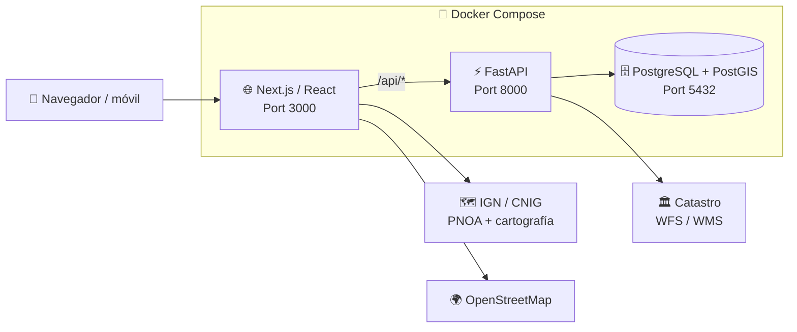

<div align="center">

# 🗺️ Catastro Digital

### Visor, organizador y herramienta de campo para parcelas catastrales en España


<br>


**Catastro Digital** permite localizar, visualizar, organizar y conservar parcelas catastrales en un mapa interactivo, combinando geometría oficial del Catastro, ortofotografía, cartografía y herramientas de uso sobre el terreno.

[Características](#-qué-puede-hacer) ·
[Instalación](#-instalación) ·
[Uso](#-cómo-se-usa) ·
[Modo campo](#-modo-campo) ·
[Backups](#-backup-exportación-e-importación) ·
[Tecnologías](#-stack-tecnológico)

</div>

---

## 🌍 ¿Qué es Catastro Digital?

Catastro Digital nace con una idea sencilla:

> **Poder entender, organizar y consultar visualmente tus terrenos sin depender de una lista de referencias catastrales difícil de interpretar.**

La aplicación consulta la geometría de las parcelas catastrales españolas, la almacena localmente en **PostgreSQL/PostGIS** y la representa sobre un mapa interactivo.

Cada parcela puede tener su propio:

- 🏷️ nombre;
- 🎨 color;
- 📁 grupo;
- 📝 notas;
- 📐 superficie;
- 🌱 superficie en hectáreas;
- 📏 perímetro;
- 🗑️ estado activo o eliminado.

Además, Catastro Digital permite agrupar varias parcelas para comprenderlas como una única finca o conjunto territorial.

Por ejemplo:

```text
Finca familiar
├── Casa                  0,83 ha
├── Prado                 0,47 ha
├── Monte                 1,31 ha
└── Huerta                0,16 ha

Total                     2,77 ha
```

---

# ✨ ¿Qué puede hacer?

## 🧭 Visualizar parcelas

Las parcelas guardadas se representan directamente sobre el mapa mediante su geometría real.

Puedes:

- asignar un color diferente a cada parcela;
- seleccionar una parcela desde la lista o desde el propio mapa;
- centrar automáticamente la cámara sobre ella;
- ocultar grupos completos;
- mostrar u ocultar parcelas eliminadas;
- consultar sus datos sin abandonar el mapa.

---

## 🖱️ Añadir parcelas haciendo clic

No necesitas conocer previamente la referencia catastral.

Activa:

**`Añadir desde mapa`**

y haz clic dentro de una parcela.

Catastro Digital:

1. obtiene las coordenadas del clic;
2. consulta el servicio oficial del Catastro;
3. identifica el polígono que contiene ese punto;
4. muestra una previsualización;
5. permite confirmar antes de guardar.

También sigue disponible la búsqueda tradicional por **referencia catastral**.

---

## 🛰️ Diferentes vistas del terreno

Puedes cambiar el mapa base en cualquier momento.

| Vista | Uso recomendado |
|---|---|
| 🗺️ **Mapa** | Carreteras, pueblos, caminos y contexto general |
| 🛰️ **Ortofoto PNOA** | Vegetación, construcciones, caminos, muros y terreno real |
| ⛰️ **Topográfico IGN** | Relieve y lectura cartográfica tradicional |

La capa de límites del Catastro es independiente del mapa base.

Una combinación especialmente útil es:

**Ortofoto PNOA + límites catastrales + parcelas coloreadas**

---

## 📐 Superficie, hectáreas y perímetros

Las medidas se calculan directamente desde las geometrías almacenadas en **PostGIS**.

Cada parcela muestra:

- superficie en `m²`;
- superficie en `ha`;
- perímetro en metros.

Ejemplo:

```text
Finca de Bouzas

Superficie       8.342 m²
Hectáreas        0,8342 ha
Perímetro        412 m
```

Los grupos también muestran estadísticas agregadas.

Cuando varias parcelas contiguas forman un conjunto, el perímetro exterior se calcula sobre la unión de sus geometrías, evitando contar como perímetro los límites internos compartidos.

---

## 📁 Organización por grupos

Las parcelas pueden organizarse en grupos como:

- Familia
- Propias
- En estudio
- Monte
- Casa
- Herencia
- Ponteareas
- As Neves

Cada grupo muestra:

- número de parcelas;
- superficie total;
- hectáreas totales;
- perímetro conjunto.

Los grupos pueden:

- crearse;
- renombrarse;
- ocultarse;
- eliminarse.

Si se elimina un grupo, sus parcelas permanecen almacenadas y pasan a **Sin grupo**.

---

## 🔎 Búsqueda y filtrado

Puedes localizar rápidamente parcelas por:

- nombre;
- referencia catastral;
- grupo.

La interfaz está pensada para seguir siendo manejable aunque la colección crezca.

---

# 📱 Modo Campo

El **Modo Campo** está pensado para usar Catastro Digital físicamente mientras recorres una finca con el teléfono.

Al activarlo, la aplicación puede utilizar la geolocalización del dispositivo para mostrar:

- 📍 tu posición;
- 🎯 precisión GPS indicada por el teléfono;
- ⭕ círculo de incertidumbre;
- 🟢 si estás dentro de una parcela;
- 🔴 si estás fuera;
- 📏 distancia al límite catastral más próximo;
- ❌ punto del lindero más cercano;
- 📐 superficie de la finca;
- 🛰️ ortofotografía PNOA como referencia visual.

### Ejemplo conceptual

```text
MODO CAMPO

GPS                         ±4 m

Finca de Bouzas             DENTRO
Superficie                  0,83 ha

Límite más cercano          12,4 m

[ Centrarme ]     [ Ver finca ]
```

Sobre el mapa se representa:

```text
        límite de la finca
   ┏━━━━━━━━━━━━━━━━━━━━━━━━┓
   ┃                        ┃
   ┃       ○ precisión      ┃
   ┃       ● tú ──────── ×  ┃
   ┃                  12 m  ┃
   ┗━━━━━━━━━━━━━━━━━━━━━━━━┛
```

Si no seleccionas previamente una parcela, Catastro Digital puede detectar automáticamente si tu posición se encuentra dentro de alguna de tus parcelas guardadas.

### ⚠️ Precisión

El modo campo es una herramienta de **orientación y comprensión visual**.

No debe utilizarse como sustituto de:

- un levantamiento topográfico;
- un deslinde oficial;
- mediciones GNSS profesionales;
- documentación registral o jurídica.

La aplicación muestra deliberadamente la precisión indicada por el dispositivo para evitar presentar el GPS de un móvil como una medición exacta.

---

# 💾 Backup, exportación e importación

Los datos introducidos en Catastro Digital tienen valor.

Por eso la aplicación incorpora herramientas de portabilidad directamente desde la interfaz.

## 📦 Backup

Genera un archivo:

```text
catastro-digital-backup_YYYY-MM-DD_HHMM.json
```

El backup incluye:

- parcelas;
- geometrías;
- nombres;
- colores;
- grupos;
- notas;
- parcelas eliminadas;
- fechas;
- metadatos necesarios para restaurar el estado de la aplicación.

El formato actual es **Backup v2** y mantiene compatibilidad de importación con backups v1.

---

## 🌐 Exportar GeoJSON

También puedes exportar todas las parcelas como:

```text
catastro-digital_YYYY-MM-DD_HHMM.geojson
```

Esto permite reutilizar las geometrías en herramientas GIS como:

- QGIS;
- ArcGIS;
- otras aplicaciones compatibles con GeoJSON.

> GeoJSON está pensado para interoperabilidad. Para restaurar Catastro Digital debe utilizarse el backup JSON propio de la aplicación.

---

## ♻️ Importar

Al importar un backup hay dos modos:

### Combinar

Actualiza y añade los elementos incluidos en el archivo sin eliminar los demás datos existentes.

### Reemplazar todo

Restaura exactamente el contenido del backup.

Este modo requiere confirmación adicional porque sustituye los datos actuales.

Las importaciones se ejecutan dentro de una **transacción PostgreSQL**. Si algún elemento no puede validarse o guardarse, la operación completa se revierte.

---

# 🎯 Intención y valor del proyecto

Catastro Digital no pretende reemplazar la Sede Electrónica del Catastro ni convertirse en un sistema catastral oficial.

Su objetivo es proporcionar una **capa personal de organización y comprensión territorial**.

Especialmente útil para:

- familias con varias fincas;
- propietarios de terrenos rurales;
- herencias con muchas parcelas;
- organización patrimonial;
- terrenos agrícolas o forestales;
- estudio de posibles adquisiciones;
- comprender límites sobre ortofotografía;
- visitar físicamente terrenos;
- conservar un inventario territorial propio.

La información oficial sigue perteneciendo a sus respectivas fuentes públicas.

Catastro Digital añade sobre ella:

**organización + visualización + contexto + persistencia + movilidad**

---

# 🏗️ Arquitectura


```mermaid
flowchart LR
    U["👤 Navegador / móvil"]

    subgraph Docker["🐳 Docker Compose"]
        W["🌐 Next.js / React<br/>Port 3000"]
        A["⚡ FastAPI<br/>Port 8000"]
        D[("🗄️ PostgreSQL + PostGIS<br/>Port 5432")]
    end

    C["🏛️ Catastro<br/>WFS / WMS"]
    I["🗺️ IGN / CNIG<br/>PNOA + cartografía"]
    O["🌍 OpenStreetMap"]

    U --> W
    W -->|/api/*| A
    A --> D
    A --> C
    W --> I
    W --> O
```

La aplicación utiliza tres contenedores:

| Servicio | Función | Puerto por defecto |
|---|---|---:|
| `cadweb_web` | Interfaz Next.js | `3000` |
| `cadweb_api` | API FastAPI | `8000` |
| `cadweb_db` | PostgreSQL + PostGIS | `5432` |

Los datos persistentes se almacenan en el volumen Docker:

```text
db_data
```

---

# 🧰 Stack tecnológico

## Frontend

| Tecnología | Versión |
|---|---:|
| Node.js | `24.19` |
| Next.js | `16.3.1` |
| React | `19.2.8` |
| React DOM | `19.2.8` |
| TypeScript | `5.9.3` |
| MapLibre GL JS | `6.3.0` |
| @types/react | `19.2.18` |
| @types/react-dom | `19.2.4` |
| @types/geojson | `7946.0.16` |

El frontend utiliza **Webpack** explícitamente con Next.js para mantener una integración estable con el worker ESM de MapLibre GL JS 6.

---

## Backend

| Tecnología | Versión |
|---|---:|
| Python | `3.12` |
| FastAPI | `0.141.1` |
| Uvicorn | `0.52.3` |
| SQLAlchemy | `2.0.52` |
| Psycopg | `3.3.4` |
| GeoAlchemy2 | `0.20.0` |
| Shapely | `2.1.2` |
| HTTPX | `0.28.1` |
| GDAL / ogr2ogr | Imagen Debian |

---

## Base de datos e infraestructura

| Tecnología | Versión / imagen |
|---|---|
| PostgreSQL | `16` |
| PostGIS | `3.4` |
| Docker | Docker Engine / Docker Desktop |
| Docker Compose | Compose v2 |
| Imagen DB | `postgis/postgis:16-3.4` |

---

# 🗃️ Fuentes cartográficas

Catastro Digital utiliza servicios públicos y abiertos de distintas administraciones y proyectos.

### 🏛️ Dirección General del Catastro

Utilizada para:

- geometría catastral;
- referencias catastrales;
- límites de parcelas;
- servicios WFS/WMS.

https://www.catastro.hacienda.gob.es/

### 🛰️ IGN / CNIG — PNOA

Utilizado como ortofotografía para inspección visual del terreno.

https://pnoa.ign.es/

### ⛰️ Instituto Geográfico Nacional

Cartografía topográfica y servicios geográficos.

https://www.ign.es/

### 🌍 OpenStreetMap

Mapa base para carreteras, caminos, localidades y contexto general.

https://www.openstreetmap.org/

---

# 🚀 Instalación

## Requisitos

La forma recomendada de ejecutar Catastro Digital es mediante Docker.

Necesitas:

- Windows, Linux o macOS;
- **Docker Desktop** o Docker Engine;
- Docker Compose v2;
- conexión a Internet para construir las imágenes y consultar servicios cartográficos.

En Windows, asegúrate de que **Docker Desktop está abierto y el Docker Engine está ejecutándose** antes de iniciar la aplicación.

---

## 1. Clonar el repositorio

```bash
git clone https://github.com/FonsiFernandez/Catastro-Digital.git
cd Catastro-Digital
```

---

## 2. Configuración opcional

La aplicación incluye valores por defecto.

Si quieres personalizarlos:

```powershell
Copy-Item .env.example .env
```

Contenido:

```env
POSTGRES_DB=cadweb
POSTGRES_USER=cadweb
POSTGRES_PASSWORD=cadweb

WEB_PORT=3000
API_PORT=8000
DB_PORT=5432
```

> Para una instalación accesible desde Internet debes cambiar las credenciales por defecto de PostgreSQL.

---

## 3. Construir y arrancar

```bash
docker compose up -d --build
```

La primera compilación puede tardar mientras Docker descarga y construye las imágenes.

---

## 4. Comprobar los servicios

```bash
docker compose ps
```

Deberías ver:

```text
cadweb_db     Up (healthy)
cadweb_api    Up (healthy)
cadweb_web    Up (healthy)
```

---

## 5. Abrir Catastro Digital

### Aplicación

```text
http://localhost:3000
```

### Documentación interactiva de la API

```text
http://localhost:8000/docs
```

### Health check

```text
http://localhost:8000/health
```

---

# 🧭 Cómo se usa

## Opción A — Referencia catastral

1. Introduce una referencia catastral.
2. Pulsa **Añadir**.
3. Catastro Digital obtiene la geometría.
4. La parcela aparece en el mapa.
5. Asígnale nombre, color, grupo o notas.

---

## Opción B — Seleccionar desde el mapa

1. Activa **Añadir desde mapa**.
2. Activa la ortofoto si quieres identificar mejor el terreno.
3. Haz clic dentro de la parcela.
4. Comprueba el contorno resaltado.
5. Pulsa **Guardar parcela**.

---

## Organizar

Después puedes:

```text
Parcela
├── Nombre
├── Grupo
├── Color
├── Notas
├── Superficie
├── Hectáreas
└── Perímetro
```

Los cambios quedan almacenados en PostgreSQL/PostGIS.

---

# 📱 Usarlo desde el móvil

La interfaz es responsive y el **Modo Campo** está diseñado especialmente para teléfonos.

Sin embargo, la API de geolocalización del navegador requiere un **contexto seguro**.

Por ello:

```text
http://localhost:3000
```

funciona correctamente en el propio ordenador, pero abrir desde el móvil:

```text
http://192.168.x.x:3000
```

puede permitir ver la aplicación y, aun así, bloquear el GPS.

Para utilizar el Modo Campo correctamente desde un teléfono se recomienda publicar Catastro Digital mediante:

- HTTPS;
- una VPN/red privada;
- un reverse proxy con TLS;
- o un despliegue privado seguro.

> La base de datos nunca debería exponerse directamente a Internet.

---

# 🛑 Detener la aplicación

```bash
docker compose down
```

Esto **no elimina tus datos**.

Para volver a levantarla:

```bash
docker compose up -d
```

---

# ⚠️ Muy importante: no borres el volumen por accidente

Evita:

```bash
docker compose down -v
```

La opción `-v` elimina los volúmenes asociados al proyecto y puede borrar la base de datos.

Antes de cambios importantes, utiliza siempre:

**Datos y copias → Backup**

---

# 🔄 Actualizar la aplicación

Antes de actualizar:

1. crea un backup desde Catastro Digital;
2. guarda el archivo fuera del proyecto;
3. actualiza el código;
4. reconstruye los contenedores.

```bash
git pull
docker compose down
docker compose up -d --build
```

Las migraciones de esquema incluidas están diseñadas para mantener los datos existentes.

---

# 👨‍💻 Desarrollo local

## Frontend

Requiere Node.js 24.x.

```powershell
cd web
npm install

$env:INTERNAL_API_URL="http://localhost:8000"

npm run dev
```

Validación completa:

```bash
npm run check
```

`npm run check` ejecuta:

```text
TypeScript type-check
        +
Next.js production build
```

---

## Backend

```powershell
cd api

python -m venv .venv
.\.venv\Scripts\Activate.ps1

python -m pip install -r requirements.txt

uvicorn app.main:app --reload
```

Para ejecutar toda la funcionalidad geoespacial fuera de Docker necesitas también:

- PostgreSQL;
- PostGIS;
- GDAL;
- `ogr2ogr`.

Por este motivo, Docker sigue siendo el método de desarrollo más reproducible.

---

# 📂 Estructura del proyecto

```text
Catastro-Digital/
│
├── docker-compose.yml
├── .env.example
├── CATASTRO.png
│
├── api/
│   ├── Dockerfile
│   ├── requirements.txt
│   │
│   └── app/
│       ├── main.py
│       ├── db.py
│       ├── models.py
│       │
│       ├── routers/
│       │   ├── parcels.py
│       │   ├── groups.py
│       │   ├── backup.py
│       │   └── wms_proxy.py
│       │
│       └── services/
│           ├── catastro_wfs.py
│           ├── catastro_circuit.py
│           └── gml_to_geojson.py
│
└── web/
    ├── Dockerfile
    ├── package.json
    ├── next.config.ts
    ├── tsconfig.json
    │
    └── src/
        ├── app/
        ├── components/
        │   ├── map/
        │   ├── sidebar/
        │   └── ui/
        ├── hooks/
        ├── lib/
        └── types/
```

---

# 🔐 Privacidad

Catastro Digital es una aplicación **self-hosted**.

Tus:

- nombres de parcelas;
- grupos;
- notas;
- colores;
- geometrías almacenadas;
- organización personal;

se guardan en tu propia base PostgreSQL/PostGIS.

La aplicación no necesita un servicio cloud propio para almacenar ese inventario.

Las consultas necesarias para obtener cartografía y geometría sí utilizan los servicios externos correspondientes.

---

# 🆓 Software libre y código abierto

Catastro Digital está concebido como un proyecto de **software libre y código abierto**:

- 👀 el código fuente puede estudiarse;
- 🛠️ puede modificarse y adaptarse;
- 🏠 puede ejecutarse en infraestructura propia;
- 🤝 puede evolucionar mediante contribuciones;
- 🔓 no depende de un servicio SaaS propietario para almacenar tus datos.

> [!IMPORTANT]
> Un repositorio público no concede automáticamente derechos de modificación o redistribución.  
> Para que Catastro Digital sea jurídicamente software libre/open source, el repositorio debe incluir un archivo `LICENSE` con una licencia explícita.
>
> Para un proyecto como este, una opción sencilla y permisiva es **MIT**. Si se desea obligar a que las versiones derivadas continúen siendo software libre, puede utilizarse **GPL-3.0**.

---

# 🤝 Contribuciones

Las mejoras, correcciones y propuestas son bienvenidas.

Flujo recomendado:

```bash
git checkout -b feature/mi-mejora
git add .
git commit -m "Add: mi mejora"
git push origin feature/mi-mejora
```

Después abre un **Pull Request** en GitHub.

También puedes utilizar **Issues** para:

- reportar errores;
- proponer funcionalidades;
- documentar problemas con Catastro/IGN;
- sugerir mejoras de UX;
- plantear nuevas herramientas GIS.

---

# 🛣️ Posibles líneas de evolución

Algunas mejoras naturales para el proyecto:

- 📷 fotos asociadas a parcelas;
- 📎 documentos y escrituras;
- 🏷️ etiquetas personalizadas;
- 🧭 medición manual de distancias;
- 📐 medición manual de superficies;
- 🛰️ comparación de ortofotos históricas;
- 📊 panel estadístico del patrimonio territorial;
- 📱 experiencia PWA;
- 🔐 autenticación para despliegues remotos;
- 🗺️ compartir una finca mediante una ficha o enlace;
- 📍 navegación y orientación avanzada en Modo Campo.

---

# ⚖️ Aviso sobre los límites catastrales

Catastro Digital es una herramienta de visualización y organización.

Las geometrías catastrales, la ortofotografía y la posición GPS pueden presentar diferencias respecto a:

- muros;
- cierres;
- caminos;
- mojones;
- levantamientos topográficos;
- límites registrales;
- realidad física sobre el terreno.

Por tanto:

> **La representación mostrada por Catastro Digital debe entenderse como informativa y orientativa, no como un deslinde legal.**

Ante una discrepancia de lindes debe recurrirse a la documentación oficial y, cuando corresponda, a profesionales de topografía, Catastro o Registro de la Propiedad.

---

# ❤️ Filosofía del proyecto

Catastro Digital intenta resolver un problema cotidiano con herramientas geoespaciales modernas:

> **Convertir referencias, polígonos y datos catastrales difíciles de interpretar en una visión clara y personal del territorio.**

Tus terrenos no deberían ser solamente una lista de códigos.

Deberían poder verse, entenderse, organizarse, recorrerlos y conservar su información.

---

<div align="center">

### 🗺️ Catastro Digital

**Open mapping · Self-hosted · PostGIS powered · Built for understanding land**

Repositorio:

https://github.com/FonsiFernandez/Catastro-Digital

</div>
