# 🏗️ Arquitectura — Catastro Digital v1.0.0

## 1. Objetivo arquitectónico

La v1.0.0 está diseñada alrededor de cuatro principios:

1. **Guest-first**: la aplicación funciona sin cuenta.
2. **Cuenta opcional**: autenticarse añade persistencia remota y sincronización.
3. **Separación entre geometría oficial y datos personales**.
4. **Una misma API para la web autenticada y futuras aplicaciones nativas**.

---

## 2. Vista de alto nivel

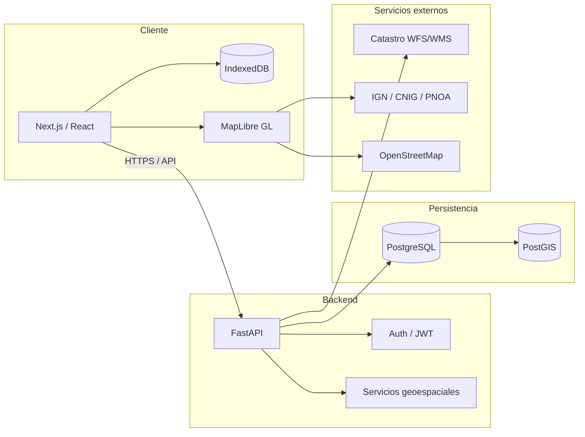

---

## 3. Componentes principales

| Capa | Tecnología | Responsabilidad |
|---|---|---|
| Web | Next.js + React + TypeScript | UI, navegación, estado, mapa |
| Mapa | MapLibre GL JS | Visualización geográfica |
| Guest storage | IndexedDB | Persistencia local sin cuenta |
| API | FastAPI | Auth, parcelas, grupos, backups, spatial queries |
| ORM | SQLAlchemy + GeoAlchemy2 | Persistencia y geometrías |
| DB | PostgreSQL + PostGIS | Datos multiusuario y operaciones GIS |
| Migraciones | Alembic | Versionado del esquema |
| Contenedores | Docker Compose | Entorno reproducible |

---

## 4. Dos modos de funcionamiento

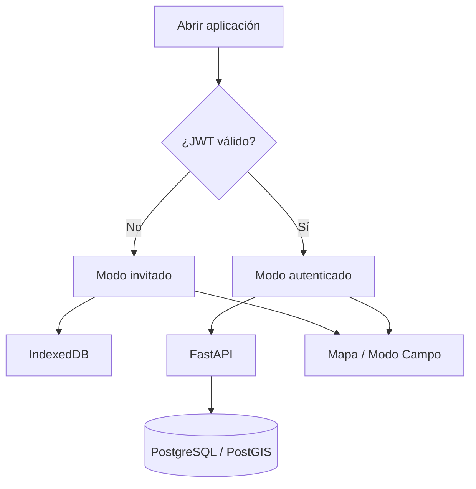

### Invitado

Los datos personales permanecen en el navegador:

- parcelas;
- geometrías;
- grupos;
- nombre;
- notas;
- color;
- estado eliminado.

No se crea ningún usuario anónimo en backend.

### Cuenta

Los datos personales quedan asociados al `user_id` autenticado.

---

## 5. Modelo de datos

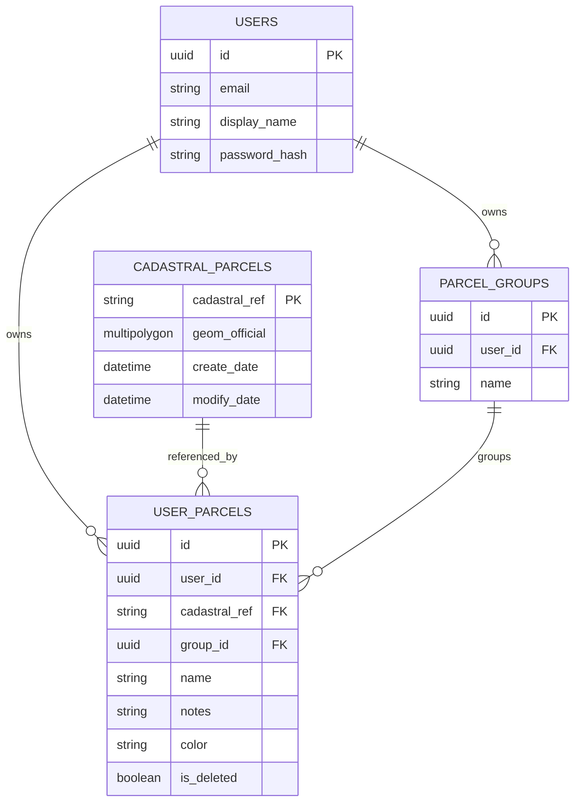

### Separación clave

`cadastral_parcels` representa la geometría oficial reutilizable.

`user_parcels` representa la capa personal del usuario.

Esto evita duplicar una misma geometría para cada usuario y, al mismo tiempo, mantiene aislados:

- nombres;
- notas;
- colores;
- grupos;
- estado eliminado.

---

## 6. Flujo de autenticación

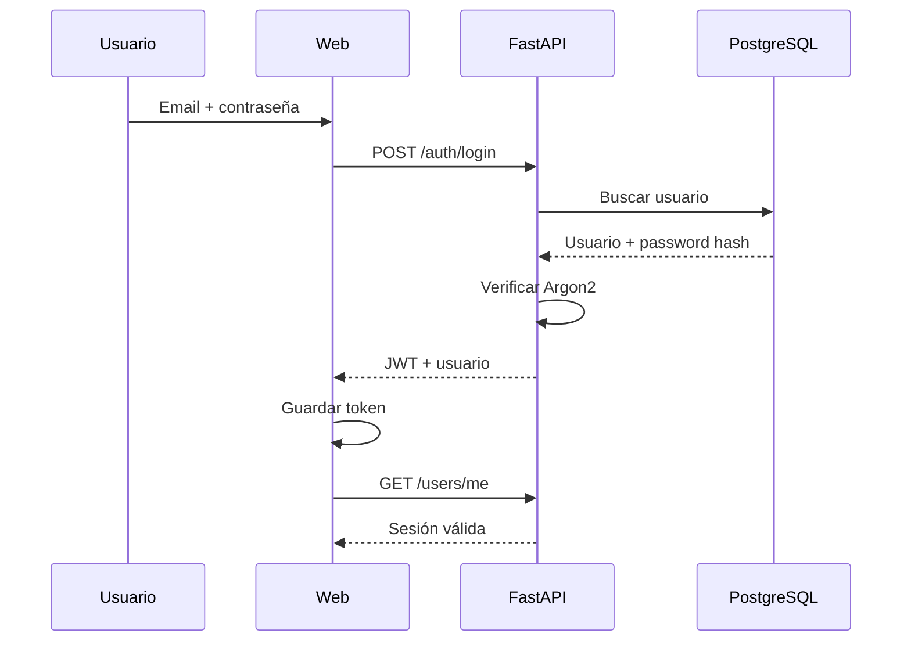

---

## 7. Flujo guest → account

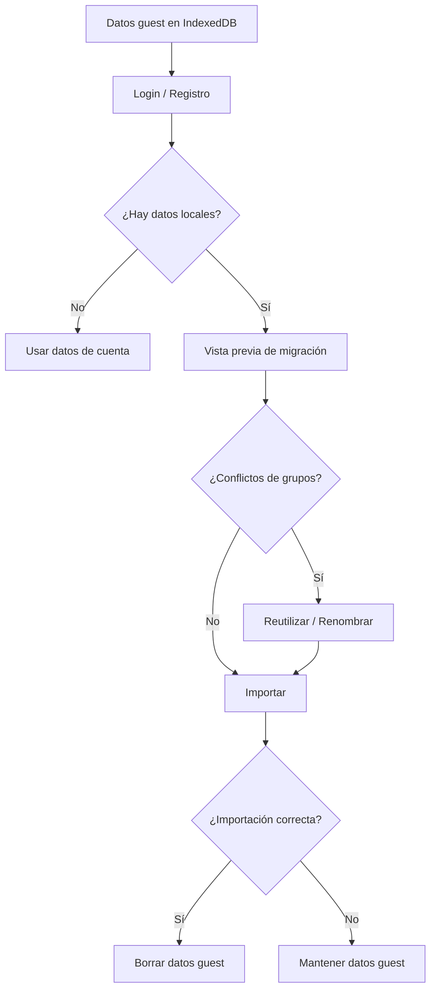

Regla importante: **los datos locales solo se eliminan tras una migración completamente correcta**.

---

## 8. Mapa e interacción geográfica

La web utiliza una única instancia persistente de MapLibre siempre que sea posible.

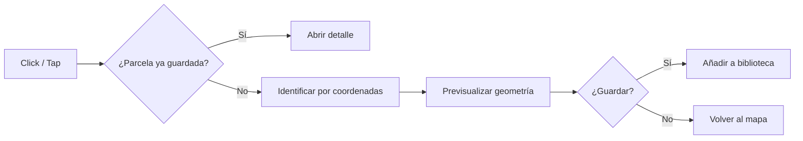

Funciones:

- seleccionar desde lista;
- seleccionar desde mapa;
- encuadrar una parcela;
- encuadrar todas;
- identificar por coordenadas;
- mostrar Catastro;
- cambiar mapa base.

---

## 9. Mapas base y capas

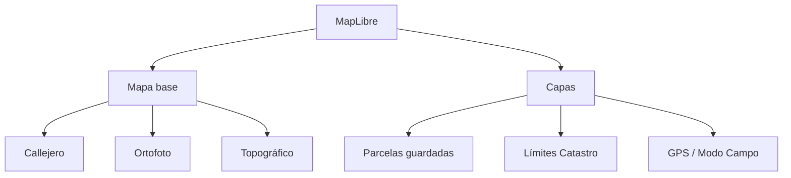

La capa Catastro puede fallar temporalmente sin invalidar los datos guardados.

---

## 10. Métricas geográficas

En cuenta autenticada, las métricas se calculan a partir de geometrías PostGIS:

- superficie;
- hectáreas;
- perímetro;
- distancias espaciales;
- contención de puntos.

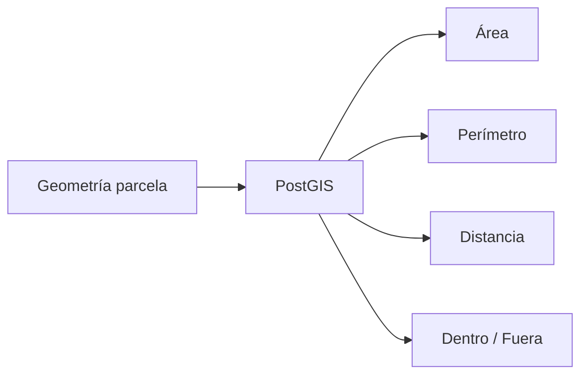

En modo invitado, las operaciones necesarias para Modo Campo se realizan localmente sobre las geometrías guardadas.

---

## 11. Navegación móvil

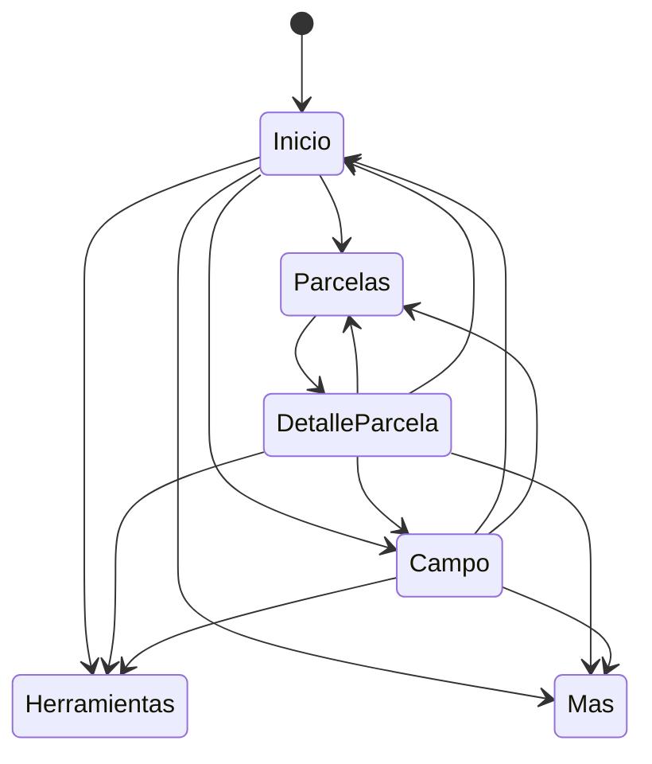

Barra inferior:

```text
Inicio · Parcelas · Campo · Herramientas · Más
```

Los grupos no son una pestaña independiente; se gestionan dentro de `Parcelas`.

---

## 12. Backup y portabilidad

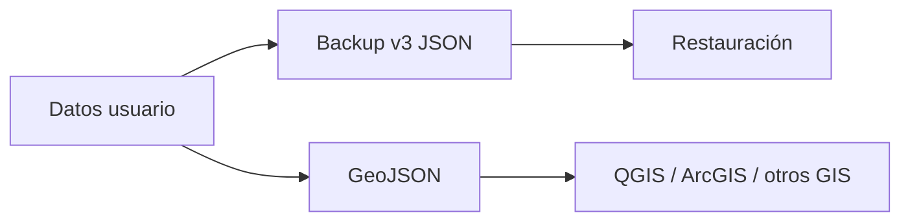

Más detalle en [BACKUP.md](./BACKUP.md).

---

## 13. Servicios externos

| Servicio | Uso |
|---|---|
| Dirección General del Catastro | geometría, referencia, WFS/WMS |
| IGN / CNIG | cartografía |
| PNOA | ortofotografía |
| OpenStreetMap | mapa base |

Estos servicios son externos y pueden:

- estar temporalmente caídos;
- responder lentamente;
- devolver información incompleta;
- cambiar su disponibilidad.

---

## 14. Migraciones de base de datos

Alembic versiona el esquema.

Evolución relevante de v1:

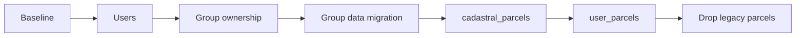

---

## 15. Dirección futura

La API se ha diseñado para poder ser reutilizada por una futura aplicación móvil:

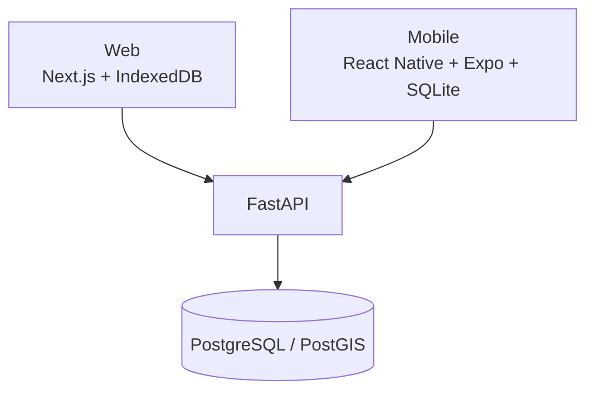

La app nativa no forma parte de v1.0.0.
