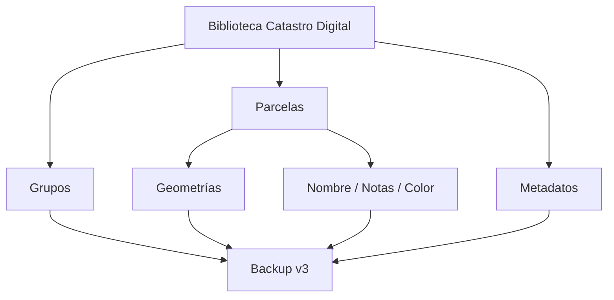
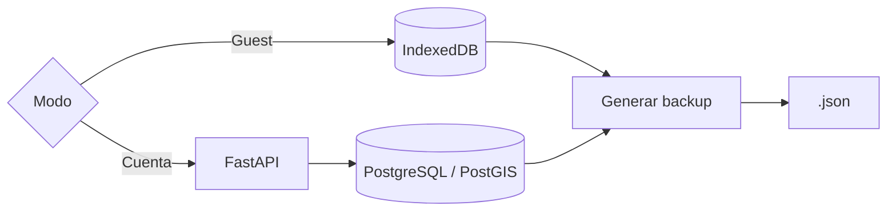
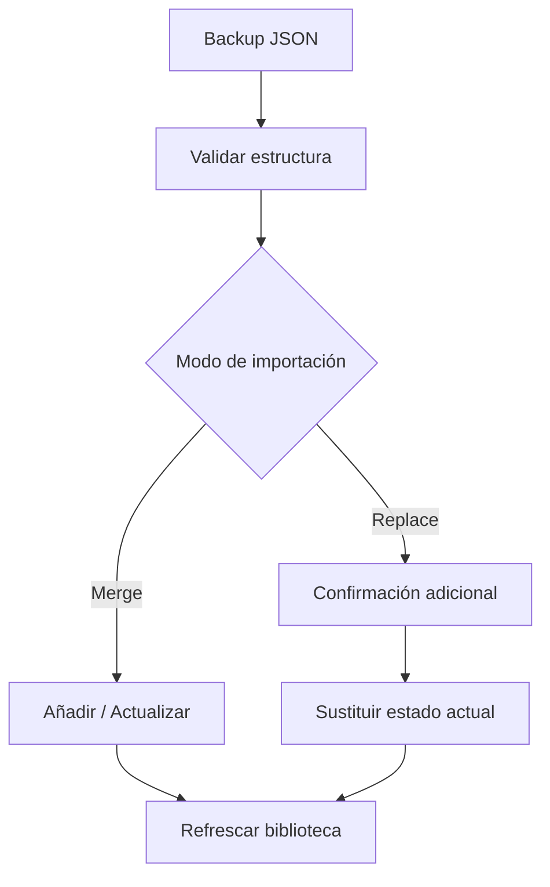
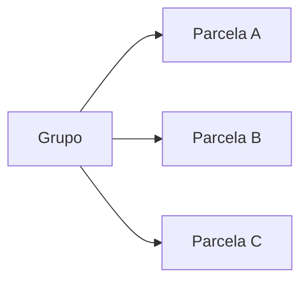
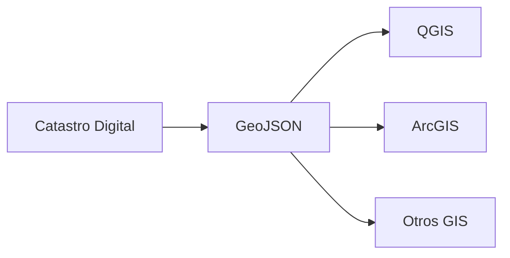
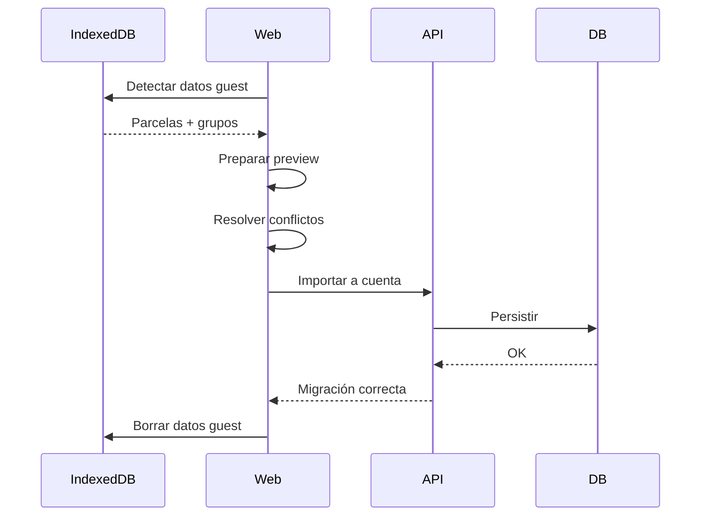
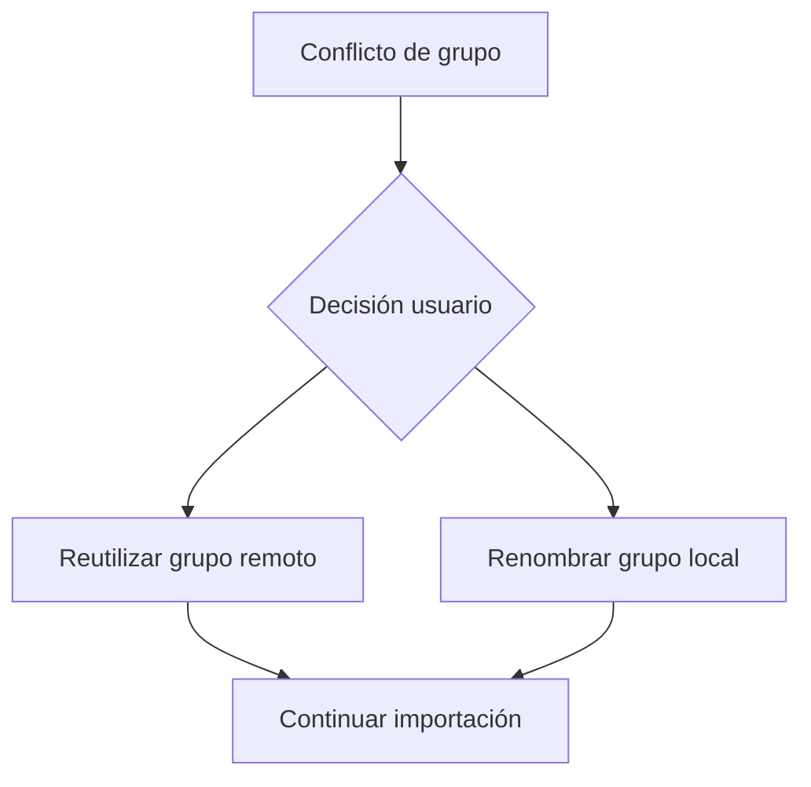
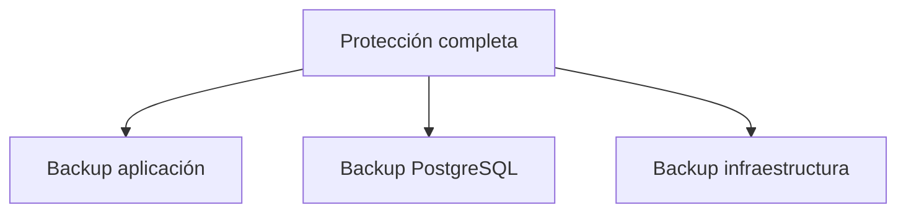

# 💾 Backup, exportación e importación — v1.0.0

## 1. Objetivo

Catastro Digital incluye dos mecanismos distintos:

| Mecanismo | Objetivo |
|---|---|
| **Backup JSON v3** | restaurar Catastro Digital |
| **GeoJSON** | interoperabilidad GIS |

> GeoJSON no sustituye al backup propio.

---

## 2. Backup v3

Nombre habitual:

```text
catastro-digital-backup_YYYY-MM-DD_HHMM.json
```

Puede contener:

- parcelas;
- geometrías;
- nombres;
- notas;
- colores;
- grupos;
- estado eliminado;
- fechas;
- metadatos de restauración.



---

## 3. Exportación según modo



### Guest

- exportación local;
- no requiere backend;
- especialmente importante si el usuario no tiene cuenta.

### Cuenta

- exportación limitada al usuario autenticado;
- el backend nunca debe mezclar datos de distintos usuarios.

---

## 4. Importación



### Merge

Conserva datos existentes y combina el contenido del backup.

### Replace

Sustituye el estado actual del usuario.

Debe tratarse como una operación destructiva y requerir confirmación.

---

## 5. Relaciones entre grupos y parcelas



Al restaurar:

- deben recuperarse primero los grupos;
- después las parcelas;
- finalmente sus relaciones.

Si un grupo se elimina desde la aplicación, sus parcelas permanecen y pasan a **Sin grupo**.

---

## 6. Parcelas eliminadas

`is_deleted` forma parte del estado del usuario.

Por ello una parcela borrada puede aparecer en un backup y ser recuperada posteriormente mediante:

```text
Mostrar borradas → Restaurar
```

---

## 7. GeoJSON



GeoJSON está pensado para:

- reutilizar geometrías;
- análisis GIS;
- intercambio con otras herramientas.

No garantiza conservar todos los metadatos internos necesarios para restaurar la aplicación.

---

## 8. Migración guest → account

Este flujo es distinto a importar manualmente un backup.



### Regla de seguridad

Si cualquier parte falla:

```text
NO borrar datos guest
```

---

## 9. Conflictos de grupos

Cuando un grupo local tiene el mismo nombre que uno remoto:



---

## 10. Backup de aplicación vs backup de infraestructura

El backup JSON protege los datos funcionales del usuario.

No sustituye:

- `pg_dump`;
- snapshots del volumen;
- backups del servidor;
- política de retención.



---

## 11. Recomendaciones operativas

Antes de:

- desplegar;
- actualizar;
- ejecutar migraciones;
- cambiar almacenamiento;
- realizar una importación `replace`;

haz al menos:

1. backup desde Catastro Digital;
2. backup de PostgreSQL si es un servidor real;
3. verificar que ambos archivos son recuperables.
