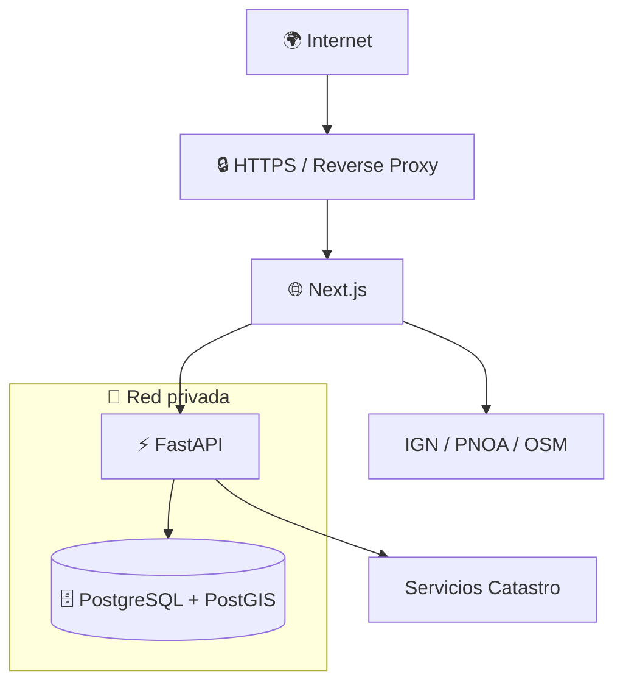
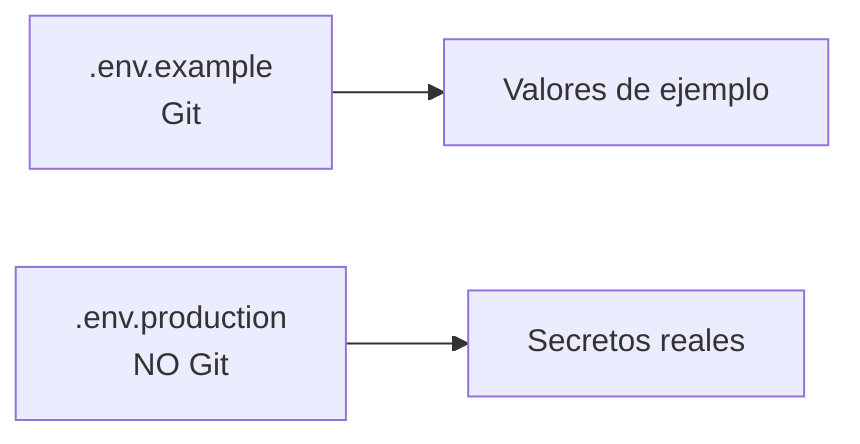
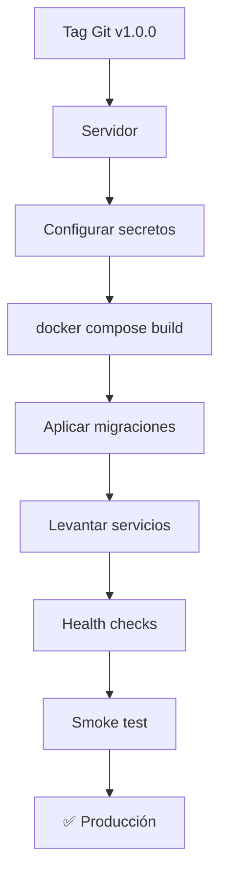
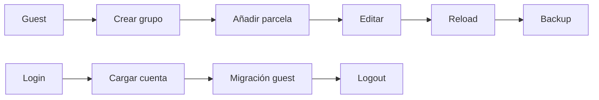
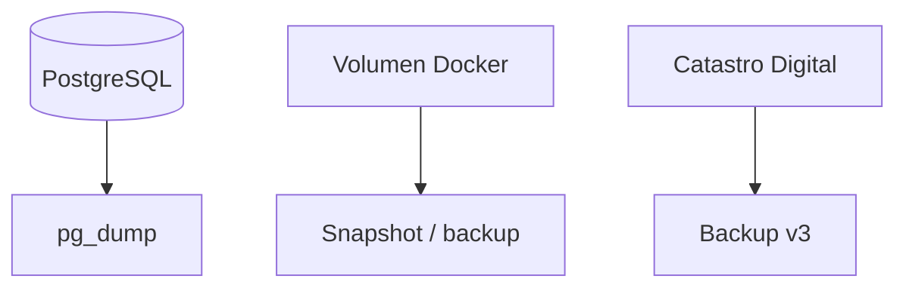

# 🚀 Despliegue — Catastro Digital v1.0.0

## 1. Arquitectura recomendada

Desarrollo:

```text
3000 → web
8000 → api
5432 → postgres
```

Producción:



### Regla principal

**PostgreSQL no debe exponerse directamente a Internet.**

---

## 2. Separación desarrollo / producción

Recomendación:

```text
docker-compose.yml
docker-compose.prod.yml
.env.example
.env.production   ← NO Git
```

---

## 3. Secretos

Producción necesita valores propios:

```env
POSTGRES_DB=...
POSTGRES_USER=...
POSTGRES_PASSWORD=...

JWT_SECRET=...
```

Generar secretos:

```bash
python -c "import secrets; print(secrets.token_urlsafe(48))"
```



Nunca versionar:

- `.env`;
- `.env.production`;
- JWT real;
- contraseña real de PostgreSQL.

---

## 4. Puertos

| Puerto | Desarrollo | Producción |
|---|---|---|
| 3000 | expuesto | interno o vía proxy |
| 8000 | expuesto | interno o vía proxy |
| 5432 | expuesto localmente | **privado** |
| 80 | opcional | redirect a HTTPS |
| 443 | opcional | público |

---

## 5. HTTPS

HTTPS es necesario para:

- proteger login;
- proteger JWT;
- usar GPS móvil;
- evitar tráfico sensible sin cifrar.

Reverse proxies habituales:

- Caddy;
- Nginx;
- Traefik.

---

## 6. Flujo de despliegue



---

## 7. Checklist previa

- [ ] Git working tree limpio
- [ ] Tag `v1.0.0`
- [ ] `.env` fuera de Git
- [ ] secretos aleatorios
- [ ] PostgreSQL no público
- [ ] HTTPS configurado
- [ ] volumen persistente
- [ ] backup DB
- [ ] backup aplicación
- [ ] migraciones Alembic listas
- [ ] health checks correctos

---

## 8. Verificación de servicios

```bash
docker compose ps
```

Esperado:

```text
cadweb_db     healthy
cadweb_api    healthy
cadweb_web    healthy
```

Backend:

```text
/api/health
```

---

## 9. Smoke test tras despliegue



Comprobar:

### Guest
- persistencia;
- grupo;
- parcela;
- backup/import.

### Cuenta
- login;
- carga automática;
- edición;
- logout/login.

### Mapa
- selección;
- Catastro;
- mapas base.

### Campo
- GPS;
- objetivo;
- dentro/fuera;
- salida.

---

## 10. Base de datos y backups

Nunca ejecutar sin entender sus consecuencias:

```bash
docker compose down -v
```

`-v` puede eliminar el volumen.

Estrategia recomendada:



---

## 11. Actualización

Para una instalación sencilla:

```bash
git pull
docker compose down
docker compose up -d --build
docker compose ps
```

En producción, preferible desplegar desde tags:

```bash
git checkout v1.0.0
```

Esto hace el despliegue reproducible.

---

## 12. Servicios externos

El servidor necesita salida hacia:

- Catastro;
- IGN/CNIG;
- PNOA;
- proveedores cartográficos configurados.

No deben considerarse dependencias 100 % disponibles.

---

## 13. Logs

Conservar logs de:

- API;
- errores DB;
- errores WFS/WMS;
- migraciones;
- autenticación anómala.

Nunca registrar:

- contraseñas;
- JWT completos;
- secretos;
- credenciales DB.
