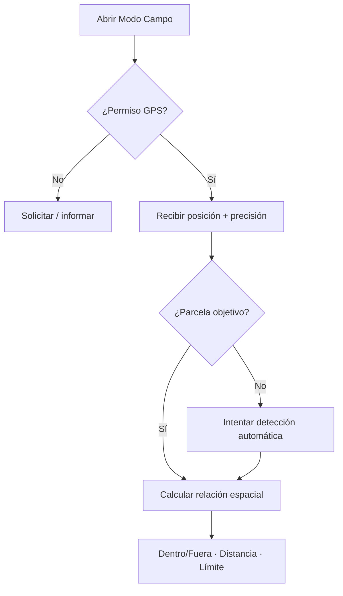
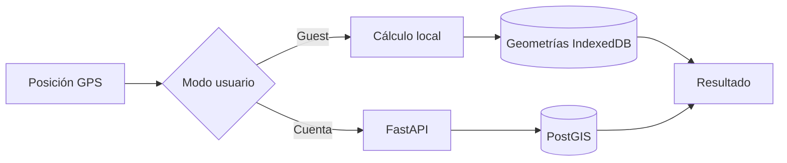
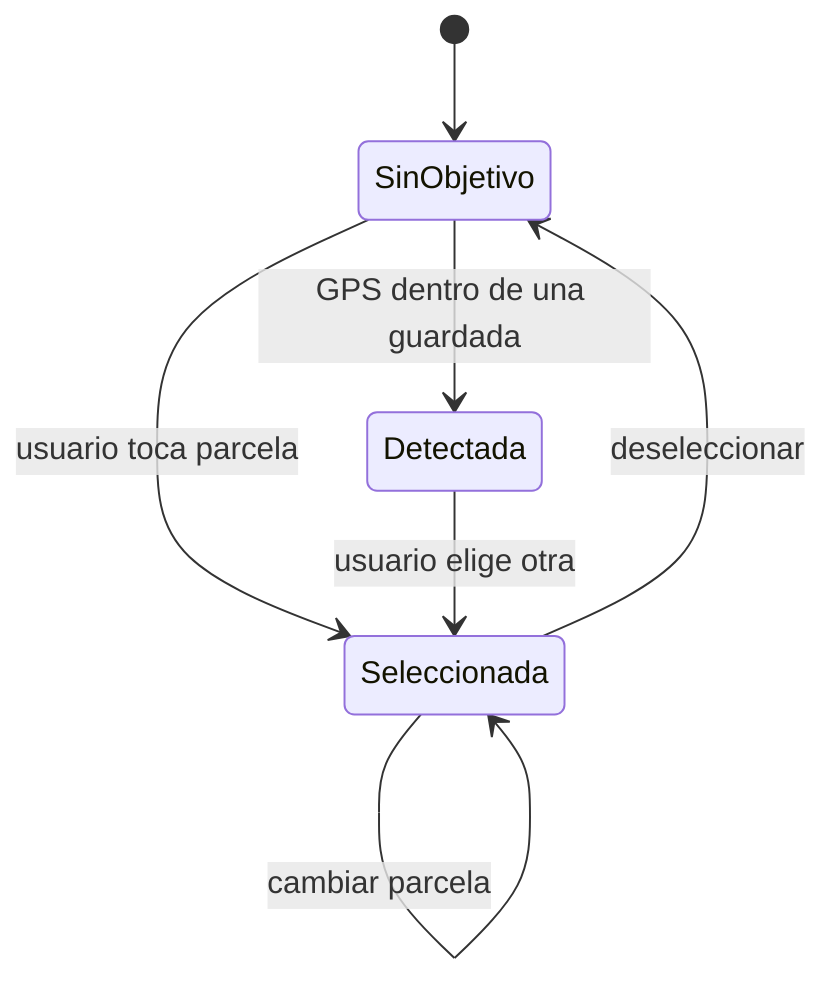
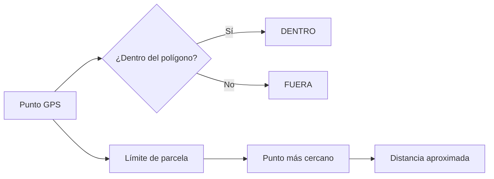
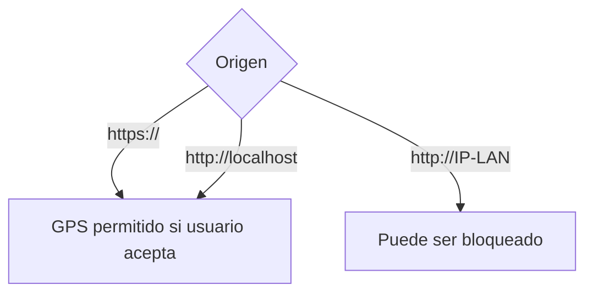
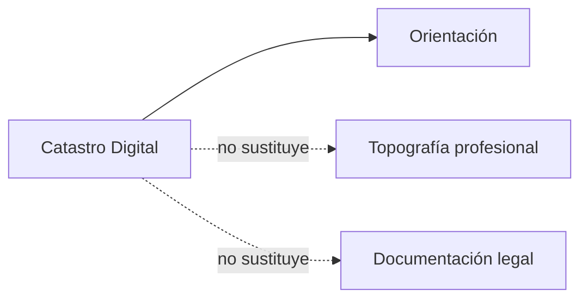

# 📍 Modo Campo — Catastro Digital v1.0.0

## 1. Propósito

Modo Campo permite utilizar las parcelas guardadas mientras el usuario se encuentra físicamente sobre el terreno.

No es una herramienta topográfica profesional.

---

## 2. Flujo general



---

## 3. Datos mostrados

La interfaz puede mostrar:

- 📍 posición actual;
- 🎯 precisión GPS;
- ⭕ círculo de incertidumbre;
- 🟢 dentro / 🔴 fuera;
- 📏 distancia aproximada al límite;
- ❌ punto del lindero más cercano;
- 📐 superficie;
- parcela objetivo.

---

## 4. Diferencia guest / account



### Guest

Los cálculos espaciales necesarios se hacen localmente.

### Cuenta

El backend utiliza PostGIS.

---

## 5. Selección de parcela objetivo



El usuario puede:

- entrar con una parcela ya seleccionada;
- elegir otra sobre el mapa;
- quitar la selección;
- volver a detección automática.

---

## 6. Cálculo espacial conceptual



---

## 7. Precisión GPS

El dispositivo proporciona una estimación de precisión.

Ejemplo:

```text
Posición GPS
Precisión: ± 4 m
```

Esto significa que la posición real puede encontrarse en un área alrededor del punto mostrado.

Por ello:

- no debe ocultarse la precisión;
- una distancia al límite menor que la incertidumbre GPS debe interpretarse con cautela;
- la app no debe presentar la posición móvil como exacta.

---

## 8. HTTPS

La geolocalización del navegador requiere un contexto seguro.



Para uso real desde teléfono: **HTTPS**.

---

## 9. Interacción móvil

La navegación inferior permanece disponible:

```text
Inicio · Parcelas · Campo · Herramientas · Más
```

Al abandonar Campo se debe cerrar el estado visual del modo antes de navegar.

---

## 10. Mapa base

Modo Campo respeta el mapa base elegido por el usuario.

Opciones:

- callejero;
- ortofoto;
- topográfico.

No obliga automáticamente a usar ortofoto.

---

## 11. Escenarios de error

| Situación | Comportamiento esperado |
|---|---|
| GPS denegado | informar sin romper la app |
| GPS temporalmente no disponible | mantener UI y permitir reintento |
| sin parcela objetivo | usar detección automática |
| Catastro externo caído | parcelas guardadas siguen siendo utilizables |
| baja precisión | mostrarla claramente |
| salir de Campo | limpiar overlays específicos |

---

## 12. Limitaciones legales y técnicas

Modo Campo es orientativo.

No sustituye:

- deslinde oficial;
- levantamiento topográfico;
- GNSS profesional;
- escritura;
- Registro de la Propiedad;
- certificación catastral;
- resolución administrativa.


