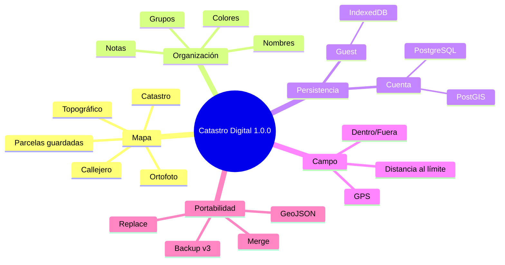
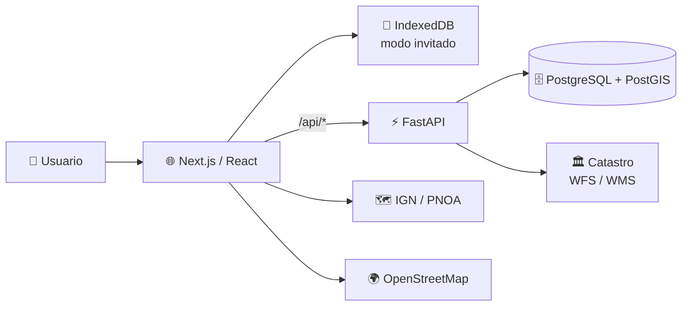

<div align="center">

# 🗺️ Catastro Digital v1.0.0

### Documentación técnica de la primera versión web estable


</div>

---

## 🎯 Alcance de la release

Catastro Digital v1.0.0 permite:

- trabajar completamente **sin cuenta**;
- crear una cuenta e iniciar sesión;
- migrar datos locales a una cuenta;
- gestionar parcelas y grupos;
- buscar por referencia catastral;
- identificar parcelas tocando o haciendo clic en el mapa;
- editar nombre, notas, color y grupo;
- borrar y restaurar parcelas;
- usar mapas base y límites catastrales;
- utilizar **Modo Campo** con GPS;
- exportar e importar backups;
- exportar GeoJSON;
- usar la aplicación desde escritorio y móvil web.



## 🧩 Documentos

| Documento | Contenido |
|---|---|
| [🏗️ Arquitectura](./ARCHITECTURE.md) | Componentes, datos, API, DB, mapas y navegación |
| [💾 Backup](./BACKUP.md) | Backup v3, importación, merge/replace y guest → account |
| [📍 Modo Campo](./FIELD-MODE.md) | GPS, cálculos espaciales, flujo de uso y precisión |
| [🚀 Despliegue](./DEPLOYMENT.md) | Producción, Docker, HTTPS, secretos y operación |
| [🔐 Seguridad](./SECURITY.md) | Auth, aislamiento multiusuario y hardening |
| [📝 Release Notes](./RELEASE-NOTES.md) | Alcance congelado de v1.0.0 |

## 🏗️ Vista rápida de arquitectura



## 📱 Navegación móvil

```text
Inicio · Parcelas · Campo · Herramientas · Más
```

Los grupos se gestionan dentro de **Parcelas**.

## ⚠️ Naturaleza de los datos

Catastro Digital es una herramienta informativa y de apoyo.

Los límites, superficies, posiciones GPS y distancias deben considerarse **orientativos** y no sustituyen documentación oficial, levantamientos topográficos ni deslindes legales.
