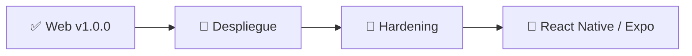

# 📝 Release Notes — Catastro Digital v1.0.0

## Primera versión web estable

`v1.0.0` representa el primer punto de referencia estable del proyecto.

---

## ✅ Incluido

### Mapa

- parcelas guardadas;
- selección desde lista o mapa;
- identificación por click/tap;
- límites catastrales;
- mapa callejero;
- ortofoto;
- topográfico;
- centrado y encuadre.

### Parcelas

- nombre;
- color;
- notas;
- grupo;
- métricas;
- borrado lógico;
- restauración.

### Grupos

- crear;
- renombrar;
- eliminar;
- filtrado;
- agrupación de parcelas.

### Invitado

- funcionamiento sin cuenta;
- IndexedDB;
- persistencia local;
- backup;
- import;
- GeoJSON;
- Modo Campo.

### Cuenta

- registro;
- login;
- JWT;
- Argon2;
- datos multiusuario;
- separación por propietario;
- migración guest → account.

### Modo Campo

- geolocalización;
- precisión GPS;
- dentro/fuera;
- distancia al límite;
- cambio de parcela objetivo;
- cálculo local para guest;
- cálculo PostGIS para cuenta.

### Backup

- formato v3;
- merge;
- replace;
- multiusuario;
- GeoJSON.

### UI

- escritorio;
- móvil web;
- navegación inferior:
  `Inicio · Parcelas · Campo · Herramientas · Más`;
- detalle de parcela;
- grupos dentro de Parcelas.

---

## 🚫 Fuera de alcance de v1.0.0

Todavía no forman parte de esta release:

- app nativa Android;
- app nativa iOS;
- refresh tokens;
- revocación de sesiones;
- recuperación de contraseña;
- verificación de email;
- rate limiting completo;
- fotos/documentos por parcela;
- mediciones manuales GIS;
- ortofotos históricas.

---

## 🧭 Siguiente etapa

La app móvil reutilizará la misma API y mantendrá el modelo guest-first.
