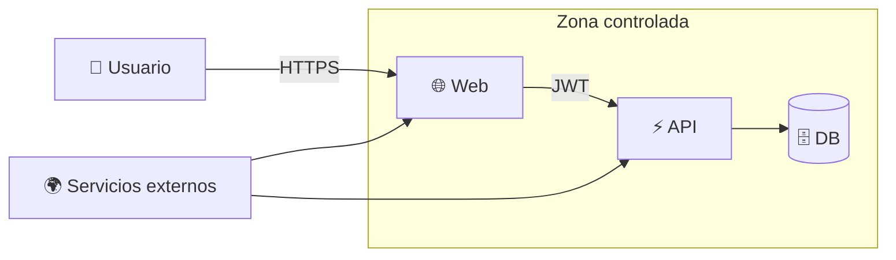
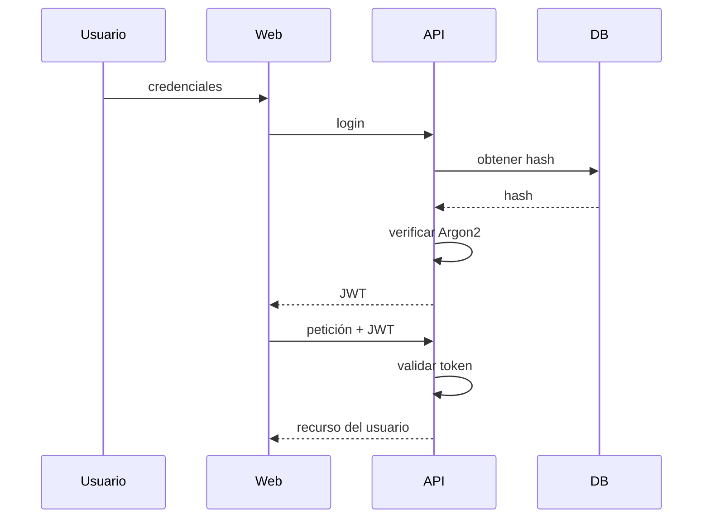
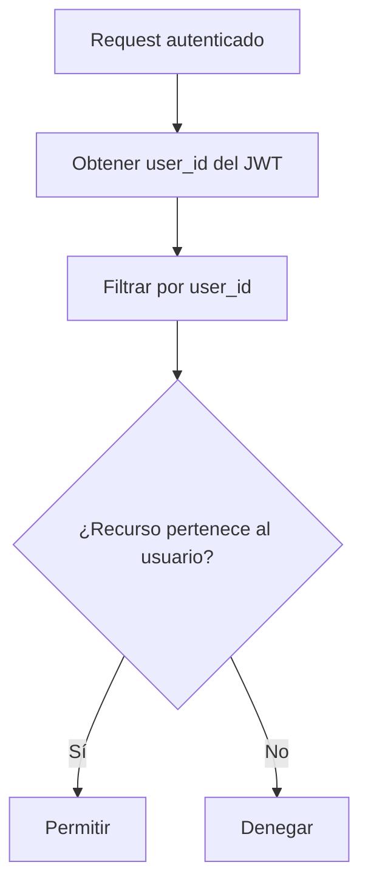
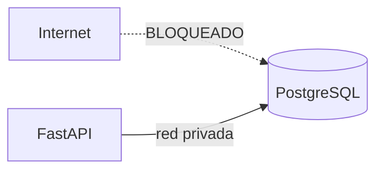
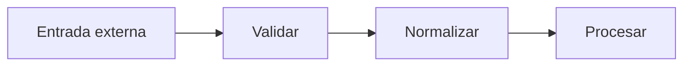

# 🔐 Seguridad — Catastro Digital v1.0.0

## 1. Modelo de confianza



Los servicios externos deben tratarse como entrada no confiable.

---

## 2. Autenticación

La v1.0.0 utiliza:

- Argon2 para contraseñas;
- JWT para sesión;
- endpoints protegidos;
- validación de propietario.



---

## 3. Aislamiento multiusuario



Debe aplicarse a:

- grupos;
- parcelas;
- edición;
- borrado;
- backup;
- importación.

---

## 4. Modo invitado

El guest:

- no crea usuario backend;
- no recibe permisos implícitos;
- guarda sus datos en IndexedDB.

Riesgo principal:

```text
borrar datos del navegador = posible pérdida local
```

Mitigación: backup.

---

## 5. Secretos

Nunca en Git:

```text
.env
.env.production
JWT_SECRET real
POSTGRES_PASSWORD real
tokens
credenciales
```

Sí en Git:

```text
.env.example
```

si contiene placeholders o valores exclusivamente de desarrollo.

---

## 6. Base de datos



Requisitos:

- DB no pública;
- credenciales fuertes;
- volumen persistente;
- backups periódicos.

---

## 7. HTTPS

Obligatorio para un despliegue público.

Protege:

- credenciales;
- JWT;
- peticiones API;
- geolocalización;
- integridad del tráfico.

---

## 8. Entrada no confiable

Tratar como no confiable:

- backups importados;
- respuestas WFS/WMS;
- referencias catastrales introducidas;
- coordenadas;
- parámetros API.



---

## 9. Endpoints públicos y protegidos

### Públicos

Solo lo necesario para:

- registro/login;
- health;
- determinadas previsualizaciones catastrales.

### Protegidos

- usuario;
- grupos;
- parcelas persistidas;
- backup/import;
- operaciones personales.

---

## 10. Backups

Un backup autenticado debe limitarse al usuario actual.

Una importación no debe poder:

- cambiar `user_id` arbitrariamente;
- modificar datos de terceros;
- saltarse validaciones.

---

## 11. Logging seguro

No registrar:

- passwords;
- secretos;
- JWT completos;
- connection strings con password.

Sí registrar:

- código de error;
- endpoint;
- timestamp;
- causa técnica;
- identificadores no sensibles cuando sean útiles.

---

## 12. Hardening posterior a v1.0.0

La v1 dispone de autenticación funcional, pero para madurar un despliegue público conviene añadir:

| Mejora | Estado v1 |
|---|---|
| Argon2 | ✅ |
| JWT | ✅ |
| aislamiento por usuario | ✅ |
| HTTPS | depende del despliegue |
| refresh tokens | ⏳ |
| revocación de sesión | ⏳ |
| password reset | ⏳ |
| email verification | ⏳ |
| rate limiting | ⏳ |
| rotación de secretos | ⏳ |
| security monitoring | ⏳ |

---

## 13. Riesgos externos

Catastro Digital depende de servicios de terceros.

Riesgos:

- timeout;
- error HTTP;
- geometría inválida;
- cambios de servicio;
- indisponibilidad.

La aplicación debe fallar de forma controlada.

---

## 14. Reporte de vulnerabilidades

Hasta disponer de un proceso formal:

- no publicar secretos en Issues;
- no publicar credenciales;
- no incluir datos personales reales;
- evitar compartir dumps de producción públicamente.

En una etapa posterior conviene añadir un `SECURITY.md` estándar de GitHub en la raíz o `.github/`.
